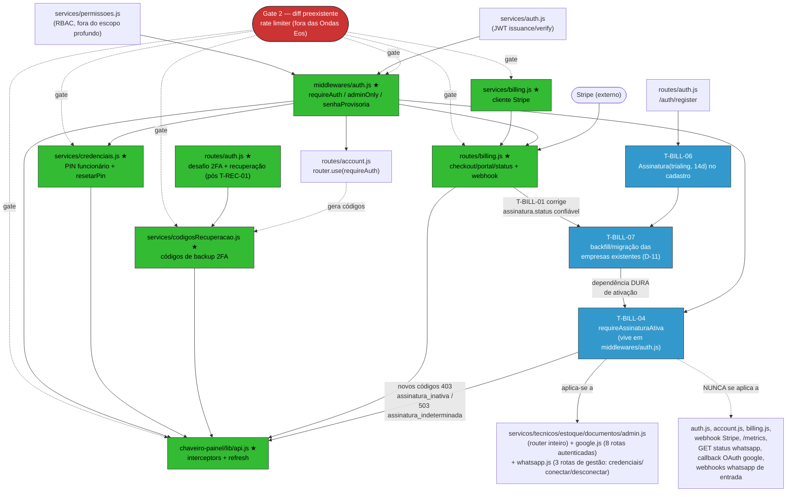

# Eos Security Closure v2 — Plano Vivo (Evidence Driven Execution)

> **Status da missão:** Planejamento. Nenhuma implementação foi feita ou autorizada por este documento.
> **Diff preexistente (Gate 2 — CONCLUÍDO, commit `2d0292c`):** `chaveiro-bot/src/app.js`,
> `chaveiro-bot/src/middlewares/rateLimiters.js`, `chaveiro-bot/src/middlewares/__tests__/rateLimiters.test.js`
> — corrige o bypass do rate limiter de login (achado C2). Depois da aprovação do Gate 1, o usuário
> autorizou explicitamente **só** o Gate 2 (revisão/aprovação deste diff especificamente, sem
> executar nenhuma tarefa `T-*`). A revisão de aprovação (4 rodadas do Codex, thread `019fbfe8`,
> cada achado verificado empiricamente) encontrou e corrigiu 3 problemas reais adicionais na MESMA
> classe de bug antes do commit — ver EV-048. **Este diff NUNCA entrou em nenhuma Onda Eos e nenhuma
> tarefa `T-*` foi tocada neste processo** — ele tem seu próprio gate (§11, Gate 2), agora fechado,
> que segue sendo pré-requisito da Onda 1 para a próxima missão.
> **Orquestrador:** Claude Code. **Analista independente:** Codex MCP (`mcp__codex__codex`), consultado
> em modo somente leitura nos pontos críticos (Gate 0; achados em auth/billing/2FA-recuperação; revisão
> deste próprio documento no fechamento do Gate 1 — §14; aprovação do diff preexistente no Gate 2).
> **Regra de ouro:** toda conclusão abaixo referencia um ID do Registro de Evidências (`EV-NNN`).
> Relatórios/PRs anteriores são hipóteses; a evidência observada NESTA execução prevalece.
>
> **STATUS DESTE DOCUMENTO: GATE 1 APROVADO, GATE 2 CONCLUÍDO, ONDA 1 IMPLEMENTADA — GATE 4 APROVADO
> (risco residual aceito explicitamente pelo usuário — ver EV-058).** O usuário autorizou e a Onda 1
> (`T-BILL-01`, `T-BILL-06`, `T-REC-01`)
> foi implementada e commitada (3 commits originais em `fix/seguranca-criticos` — ver §11, Gate 4). Uma
> revisão independente pós-implementação encontrou 2 correções obrigatórias (T-BILL-06 não cobria
> `/setup`/`services/bootstrap.js`; um teste de `T-REC-01` não exercitava de fato o caso que dizia
> cobrir) — corrigidas em 2 commits corretivos SEPARADOS, nunca reescrevendo os 3 commits originais
> (ver EV-051). A 1ª execução real do CI de integração (Postgres real) encontrou uma 3ª regressão
> genuína, não prevista pelas revisões anteriores: `test/integration/bugs_regressao.test.js` (caso B2)
> criava uma `Assinatura` manualmente após `criarEmpresaComAdmin`, colidindo com a unique constraint de
> `empresaId` porque `T-BILL-06` passou a criar esse registro automaticamente no cadastro. Corrigida em
> commit corretivo SEPARADO (`a0352cc`, `upsert` em vez de `create`), sem reescrever nenhum commit
> anterior — ver EV-052. Após essa correção, o CI (`ci.yml`, run `30758803840`) e o workflow de
> segurança (`security.yml`, run `30758803848`) fecharam **success** de ponta a ponta, incluindo os 2
> testes de integração novos com Postgres real; validação local (362/362 testes unitários, lint,
> prettier via `git diff --quiet`, typecheck) foi reconfirmada nesta missão de encerramento — ver
> EV-053. **O Gate 4 tinha 2 pendências formais, nenhuma é bug nos commits do Gate 4, ambas
> conscientemente aceitas pelo usuário (EV-058):** (1) a revisão independente obrigatória (Codex,
> modo REVISOR, conversa nova, exigida tanto pelo `AGENTS.md` quanto pela Fase 6 desta própria missão
> de encerramento) falhou por indisponibilidade do serviço Codex ("hit your usage limit... try again
> at Aug 8th, 2026 12:38 AM"), não por achado técnico — `AGENTS.md`: "Se Codex estiver indisponível,
> uma decisão material fica bloqueada. Não existe fallback silencioso." (EV-053); substituída, por
> decisão do usuário, por uma revisão adversarial ad-hoc (2 agentes independentes, ver EV-054); (2)
> essa revisão ad-hoc encontrou 2 riscos de segurança reais e verificados diretamente pelo
> orquestrador: uma race condition pré-existente em `services/codigosRecuperacao.js` (código não
> tocado por nenhum commit desta frente, mas tornado alcançável no fluxo real pela correção de
> `T-REC-01` — EV-056) e um risco de abuso de trial via cadastro em massa, tornado mais valioso por
> `T-BILL-06` (EV-057). Nenhum dos dois é regressão introduzida pelos commits do Gate 4 — cada tarefa
> fez exatamente o que foi decidido/autorizado. **O usuário, apresentado com os 2 achados, escolheu
> explicitamente fechar o Gate 4 aceitando o risco residual**, documentando ambos como itens 28-29 da
> Discovery Queue (§4) para triagem numa missão futura, em vez de corrigir agora ou esperar o Codex
> voltar (~8/ago) — ver EV-058. Nenhuma execução autorizou merge para `master`; a PR #100 permanece em
> `draft`, aberta somente para disparar o CI.

---

## 0. Metadados da execução (Gate 0 — resumo)

| Campo | Valor | Evidência |
|---|---|---|
| HEAD | `3330b10d9c8ed1f1e678bc8bb151b6f0e7559149` | EV-001 |
| Branch | `fix/seguranca-criticos` (upstream `origin/master`, +1 commit) | EV-001 |
| Working tree | 3 arquivos modificados (diff preexistente, ver acima) + `.codex/` não rastreado | EV-001 |
| Worktrees ativas | `agent-environment` (esta), `AdmAi` (feat/painel-axe-bloqueante), `TASK-023-teste-cobertura`, `TASK-024-codex-autonomia` | EV-001 |
| Último PR mergeado | #99 `fix/ede-achados` (2026-08-01) | EV-003 |
| PR aberto para esta branch | Nenhum | EV-003 |
| Config Codex (`.codex/config.toml`) | `approval_policy=on-request`, `default_permissions=workspace-only`, rede desabilitada, `.env*` negado | EV-006 |
| CI | 4 workflows: `ci.yml`, `security.yml`, `deploy.yml`, `release.yml` | EV-007 |
| Gate de segurança CI | Semgrep (OWASP Top10+JS, gate só em `ERROR`), gitleaks (secret scan), `npm audit --audit-level=high` | EV-008 |
| Gate de cobertura CI | Limiar GLOBAL baixo — bot: stmts 27% / branches 22% / funcs 28% / lines 27%; painel: ~29-31% | EV-009 |
| Gate de tipos CI | `tsc --noEmit`, `checkJs:false` — só valida arquivos com `// @ts-check` no topo | EV-009, EV-012 |
| Testes (bot) | `npm run test:coverage` → **333/333 passam**, 36 arquivos, cobertura global 28.29% stmts | EV-010 |
| Testes (painel) | Suíte completa passa, cobertura global ~30.28% stmts | EV-011 |
| `npm audit --audit-level=high` (bot) | 0 vulnerabilidades | EV-029 |
| `npm audit --audit-level=high --omit=dev` (painel) | 0 (gate passa), mas **2 MODERATE** fora do piso do gate (`react-router`, ver EV-030) | EV-030 |

### Anomalia de processo (não é vulnerabilidade de segurança, registrada por transparência)

`CLAUDE.md` na raiz do repo é um template genérico ("Ruflo — Claude Code Configuration") sobre
orquestração de swarms via `npx @claude-flow/cli`, **sem nenhuma referência ao domínio real do
projeto** (AdmAi/chaveiro-bot/chaveiro-painel). As instruções específicas do projeto — incluindo um
checklist OWASP Mobile Top 10 — vivem, em vez disso, dentro de `README.md`, seção "SKILL — Fluxo de
Desenvolvimento AdmAi" (EV-004, EV-005). Não há evidência de que `@claude-flow/cli` seja uma
dependência real instalada nos `package.json` do monorepo. Isso não afeta o resultado de segurança do
código. **D-08 resolvida (opção A)** — ver §5. `T-DOC-01` permanece fora do Gate 2 e do Definition of
Done de Segurança (§10), por instrução explícita do usuário.

---

## 1. Registro de Evidências

> **Nota metodológica (correção pós-revisão independente):** algumas entradas abaixo (ex.: EV-047,
> EV-049) registram instruções/autorizações do usuário DENTRO desta conversa (ex.: "Aprovo o Gate 1",
> "Autorizo iniciar a Onda 1"). Essa é uma classe de evidência DIFERENTE do resto do registro — não é
> um arquivo, commit ou saída de comando que um auditor externo (incluindo o Codex, que só lê o
> sistema de arquivos) possa abrir e conferir. É um fato atestado pelo orquestrador (Claude), que
> esteve presente na conversa, não uma evidência verificável de forma independente a partir do
> repositório. Marcá-la como "Confirmado" sem essa ressalva superestima o grau de verificabilidade.
> A partir desta correção, essas entradas usam o rótulo **"Atestado pelo orquestrador (não verificável
> a partir do repositório)"** em vez de "Confirmado", e — onde existir — a entrada aponta também para
> a evidência DERIVADA que É verificável em arquivo (ex.: os commits que resultaram da autorização).

| ID | Hipótese | Fonte | Evidência | Status | Confiança | Impacto |
|---|---|---|---|---|---|---|
| EV-001 | Estado real do git (HEAD/branch/worktrees/status) | `git rev-parse HEAD`, `git branch --show-current`, `git worktree list`, `git status --porcelain=2 -b` | Saída de comando, capturada nesta execução | Confirmado | Alta | Contexto |
| EV-002 | Histórico recente de commits reflete ciclo de segurança em andamento (F1-F9, ciclos 1-2, EDE) | `git log --oneline -20` | Saída de comando | Confirmado | Alta | Contexto |
| EV-003 | Histórico de PRs mergeados/abertos | `gh pr list --limit 20 --state all`, `gh pr view` | Saída de comando | Confirmado | Alta | Contexto |
| EV-004 | `CLAUDE.md` da raiz é um template genérico não relacionado ao projeto | Leitura direta de `CLAUDE.md` | Conteúdo lido nesta execução (177 linhas, tema claude-flow/swarm) | Confirmado | Alta | Baixo (processo) |
| EV-005 | Guia real do projeto (incl. checklist OWASP Mobile Top10) está no `README.md`, não no `CLAUDE.md` | Leitura de `README.md` (topo) | Seção "SKILL — Fluxo de Desenvolvimento AdmAi" | Confirmado | Alta | Baixo (processo) |
| EV-006 | Config Codex é restritiva (workspace-only, sem rede, aprovação sob demanda) | Leitura de `.codex/config.toml` | Conteúdo lido | Confirmado | Alta | Contexto |
| EV-007 | 4 workflows de CI existem | `ls .github/workflows` | `ci.yml`, `deploy.yml`, `release.yml`, `security.yml` | Confirmado | Alta | Contexto |
| EV-008 | `security.yml` roda Semgrep, gitleaks, `npm audit` em PR + semanal | Leitura de `.github/workflows/security.yml` | Conteúdo lido | Confirmado | Alta | Médio |
| EV-009 | Gates de cobertura e tipos existem mas são limitados/globais | Leitura de `.github/workflows/ci.yml`, `vitest.config.js` (bot) | `thresholds: statements 27, branches 22, functions 28, lines 27` (bot); `typecheck` roda `tsc -p jsconfig.json` | Confirmado | Alta | Alto |
| EV-010 | Cobertura real por arquivo dos 6 componentes prioritários (bot) | `npx vitest run --coverage --coverage.reporter=text` (chaveiro-bot) | Ver §2.1 | Confirmado | Alta | Alto |
| EV-011 | Cobertura real do painel, incl. `lib/api.js` | `npx vitest run --coverage --coverage.reporter=text` (chaveiro-painel) | `api.js`: 46.66% stmts / 56.66% branches / 45.45% funcs / 45.23% lines; global painel 30.28%/31.44%/29.69% | Confirmado | Alta | Médio |
| EV-012 | Gate de tipos cobre só 3/67 (bot) e 2/88 (painel) arquivos; nenhum dos 6 componentes-alvo está coberto, exceto `codigosRecuperacao.js` | `grep -rl "// @ts-check" src` em cada app + grep individual nos 6 arquivos-alvo | `middlewares/auth.js`, `services/credenciais.js`, `services/billing.js`, `routes/billing.js`, `lib/api.js`: SEM `@ts-check`. `services/codigosRecuperacao.js`: COM `@ts-check` | Confirmado | Alta | Alto |
| EV-013 | Testes de integração (Supertest+Postgres) cobrem parcialmente login/reset-PIN, mas não billing nem recuperação 2FA | Listagem de `test/integration/*.test.js` (23 arquivos, 3396 linhas) + grep por `billing`/`stripe`/`codigosRecuperacao` | `auth.test.js` (9 casos: setup, login, requireAuth); `bugs_regressao.test.js` tem 1 menção incidental a `stripeCustomerId` (teste de exclusão de empresa, não exercita `services/billing.js`); nenhum arquivo testa `codigosRecuperacao.js` ou o webhook Stripe | Confirmado | Alta | Alto |
| EV-014 | Leitura completa de `middlewares/auth.js` (109 linhas) | Leitura direta | `requireAuth`, `adminOnly`, `requirePermissao`, `senhaProvisoria`, `VERIFICACAO_BYPASS` | Confirmado | Alta | — |
| EV-015 | Leitura completa de `services/credenciais.js` (98 linhas) | Leitura direta | `gerarPin`, `gerarUsernameTecnico`, `criarAcessoTecnico`, `resetarPin` | Confirmado | Alta | — |
| EV-016 | Leitura completa de `services/billing.js` (81 linhas) | Leitura direta | Cliente Stripe lazy, `obterOuCriarCliente`, `criarCheckoutSession`, `criarPortalSession`, `processarEvento`, `sincronizarAssinatura` | Confirmado | Alta | — |
| EV-017 | Leitura completa de `routes/billing.js` (177 linhas) | Leitura direta | Rotas `/billing/checkout`, `/billing/portal`, `/billing/status`, `stripeWebhookRouter`, `despacharEvento` | Confirmado | Alta | — |
| EV-018 | Leitura completa de `services/codigosRecuperacao.js` (63 linhas) | Leitura direta | `gerarCodigos`, `verificarCodigo`, `quantidadeCodigos` | Confirmado | Alta | — |
| EV-019 | Leitura completa de `chaveiro-painel/src/lib/api.js` (120 linhas) | Leitura direta | Axios client, interceptors, refresh dedup, `limparSessao`, token em `localStorage` | Confirmado | Alta | — |
| EV-020 | **`req.user.email` é sempre `undefined` em `routes/billing.js:21`** — `requireAuth` nunca inclui `email` em `req.user` | Grep próprio (`req\.user\.email`) + leitura de `middlewares/auth.js:41-51` + **verificação independente Codex** (thread `019fbf30`) | `middlewares/auth.js:41` monta `req.user` sem campo `email`; único uso de `req.user.email` no backend é `routes/billing.js:21` | **CONFIRMADO (cross-verificado)** | Muito alta | Alto (billing) |
| EV-021 | **Webhook `checkout.session.completed` nunca sincroniza a assinatura** — Checkout Session criada sem `metadata.empresaId`, webhook lê `obj.metadata?.empresaId` (sempre `NaN`) e sai em `break` silencioso | Leitura de `services/billing.js:39-55` (sem `metadata`) + `routes/billing.js:99-113` + **verificação independente Codex** (thread `019fbf30`) | `services/billing.js:48` (session.create sem metadata); `services/billing.js:26` (metadata só no Customer); `routes/billing.js:103` (`obj.metadata?.empresaId` → `NaN`) | **CONFIRMADO (cross-verificado)** | Muito alta | Alto (billing/receita) |
| EV-022 | **`POST /me/2fa/recuperar` é inalcançável pelo fluxo que deveria servir** — gated por `requireAuth` (sessão completa) mas o usuário nesse ponto só tem o token de "desafio" pré-autenticação; frontend não chama a rota | `account.js:40` (`router.use(requireAuth)`) + `account.js:476` (rota) + `routes/api.js:13` (montagem sem exceção) + grep `2fa/recuperar` em `chaveiro-painel/src` (0 resultados) + **verificação independente Codex** (thread `019fbf30`) | Ver citações exatas no thread Codex | **CONFIRMADO (cross-verificado)** | Muito alta | Alto (lockout de conta) |
| EV-023 | Ordem de montagem do webhook Stripe vs. parser JSON NÃO é um bug | Leitura de `app.js:66-71` | O parser JSON global já pula qualquer path que comece com `/webhook/` (`if (req.path.startsWith('/webhook/')) return next();`), então `stripeWebhookRouter` (montado depois) recebe corpo intacto independentemente da ordem | Refutado (hipótese descartada) | Alta | — |
| EV-024 | Não há nenhum gate de acesso (paywall/RBAC) no backend que dependa de `assinatura.status` hoje | `grep -rn "assinatura.*status" src` (chaveiro-bot) | Único uso é dentro do próprio `routes/billing.js` (endpoint informativo `GET /billing/status`) | Confirmado | Média-alta (busca por regex, não é prova exaustiva) | Contextual — **superado por D-02: paywall passa a ser obrigatório (`T-BILL-04`)** |
| EV-025 | Verificação do "desafio" 2FA é duplicada (não compartilhada) entre `routes/auth.js` (função local `verificarDesafio2fa`, não exportada) e `routes/account.js` (reimplementada inline em `/me/2fa/recuperar`) | Leitura de `routes/auth.js:111-114` e `routes/account.js:483-491` | Mesma lógica (`jwt.verify` + checar `tipo==='2fa'` e `sub`) escrita duas vezes em arquivos diferentes | Confirmado | Alta | Médio (risco de drift) — **incorporado como critério de implementação de `T-REC-01` (D-03), não é mais tarefa separada** |
| EV-026 | `services/credenciais.js` tem cobertura de comportamento parcial via integração (não é 100% código-morto como o número 0% sugere) | Leitura de `test/integration/bugs_regressao.test.js:74-149` (suite "C1 — reset de PIN") | Exercita `resetarPin` via `POST /api/tecnicos/:id/acesso/reset`; não exercita `criarAcessoTecnico`/`gerarUsernameTecnico` diretamente | Confirmado | Alta | Médio |
| EV-027 | Nenhum rate limiter dedicado cobre `/me/2fa/recuperar`, `/me/2fa/ativar` ou `/me/2fa/desativar` | Leitura de `app.js:126-140` (só `/api/auth/login/2fa` e `/api/auth/login/2fa-telefone` têm `twoFactorLimiter`) | `app.use('/api/auth/login/2fa', twoFactorLimiter)` / `.../2fa-telefone` — nenhuma linha equivalente para `/api/me/2fa/*` | Confirmado | Alta | Médio (defesa em profundidade) |
| EV-028 | O projeto já tem o padrão estabelecido de "todo fluxo sensível ganha limiter dedicado" (ex.: `exclusaoContaLimiter`) | Import em `account.js:28` | `import { exclusaoContaLimiter } from '../middlewares/rateLimiters.js'` | Confirmado | Alta | — |
| EV-029 | `npm audit --audit-level=high` limpo no bot | `npm audit --audit-level=high` (chaveiro-bot) | "found 0 vulnerabilities" | Confirmado | Alta | — |
| EV-030 | Painel tem 2 vulnerabilidades MODERATE fora do piso do gate de CI | `npm audit --audit-level=high --omit=dev` (chaveiro-painel) | `react-router` 6.0.0-7.17.0: open redirect via backslash em `<Link>`/`useNavigate` (bypass de CVE) + injeção de construtor arbitrário via `deserializeErrors()` em SSR hydration | Confirmado | Alta | Baixo-médio — **D-06 resolvida: upgrade controlado (`T-DEPS-01`)** |
| EV-031 | `Assinatura.status` tem enum documentado no schema (`trialing \| active \| past_due \| canceled \| incomplete`) com `@default("trialing")`; `trialFimEm` é opcional | Leitura de `prisma/schema.prisma:468-482` e `prisma/schema.sqlite.prisma:442-444` | `status String @default("trialing")`, comentário explícito com os 5 valores válidos | Confirmado | Alta | Crítico para o desenho de `T-BILL-04` |
| EV-032 | **Nenhum código cria o registro `Assinatura` no cadastro da empresa** — o registro só nasce (lazy) em `obterOuCriarCliente`, na primeira vez que a empresa toca o Stripe | `grep -rn "assinatura\.(create\|upsert)" src` | Únicos 2 `upsert` de `Assinatura` em todo o backend: `services/billing.js:31-34` (dentro de `obterOuCriarCliente`) e `:75-78` (`sincronizarAssinatura`, chamado só pelo webhook) | Confirmado | Alta | Crítico — toda empresa nova fica SEM registro de `Assinatura` até tocar billing pela 1ª vez; molda o desenho do estado "ausente" em `T-BILL-04` |
| EV-033 | Estrutura de montagem de `routes/api.js` — todos os routers de recurso são montados em `/` sobre o mesmo `router` | Leitura de `routes/api.js` (23 linhas) | `authRouter`, `accountRouter`, `servicosRouter`, `tecnicosRouter`, `estoqueRouter`, `documentosRouter`, `adminRouter`, `billingRouter`, todos via `router.use('/', X)` | Confirmado | Alta | Define onde `T-BILL-04` deve (e não deve) ser aplicado |
| EV-034 | Revisão independente do Codex (thread `019fbf4f`) encontrou dependência incompleta de `T-BILL-05B` em §12 (faltava `T-BILL-02`, presente só na tabela §6) | `mcp__codex__codex`, somente leitura, 2 chamadas (a 1ª, cobrindo o documento inteiro, expirou por timeout — registrado como evidência de processo) | Achado confirmado e corrigido nesta atualização (§12, `T-BILL-05B`) | **CONFIRMADO (cross-verificado, corrigido)** | Alta | Baixo (inconsistência de planejamento, não de código) |
| EV-035 | Revisão independente do Codex (thread `019fbf4f`, 2ª rodada) não encontrou autorização acidental de implementação (cabeçalho/Gate 2) nem critérios impossíveis de verificar em `T-BILL-04`/`T-CI-01` | `mcp__codex__codex`, somente leitura | "Nenhum achado" nos itens 1 e 2 da 2ª rodada | Confirmado (ausência de achado) | Alta | — |
| EV-036 | Revisão independente do Codex (thread `019fbf4f`, 2ª rodada) encontrou linguagem em `T-BILL-04`/§12 que apresentava a proposta técnica "assinatura ausente = acesso liberado" como se fosse instrução explícita do usuário, quando só a lista dos 5 estados a testar era instrução do usuário — o comportamento em si é proposta pendente de confirmação | `mcp__codex__codex`, somente leitura | Achado confirmado e corrigido nesta atualização (§12, `T-BILL-04`, campo "Critérios de teste") | **CONFIRMADO (cross-verificado, corrigido)** | Alta | Médio (decisão implícita indevida, já corrigida) — **superado nesta rodada: a semântica de "ausente" mudou por decisão explícita do usuário (D-12), ver EV-039** |
| EV-037 | `routes/whatsapp.js` mistura, no MESMO router (`whatsappRouter`), rotas autenticadas por `requireAuth` aplicado por-rota (não `router.use`) com webhooks de entrada SEM `requireAuth` — o paywall não pode usar `router.use()` neste arquivo sem gatear o webhook por engano | Leitura direta de `routes/whatsapp.js` (linhas 24-274) | Autenticadas: `POST /api/whatsapp/cloud/credenciais` (`requireAuth`+`requirePermissao`), `GET /api/bot/whatsapp/status` (`requireAuth`, leitura, visível a qualquer autenticado), `POST /api/bot/whatsapp/conectar` (`requireAuth`+`requireSuperAdmin`), `POST /api/bot/whatsapp/desconectar` (`requireAuth`+`requireSuperAdmin`). SEM `requireAuth` (webhooks de entrada, nunca gated): `POST /webhook/whatsapp`, `GET`/`POST /webhook/whatsapp/cloud/:empresaId` | Confirmado | Alta | Crítico para o desenho de `T-BILL-04` (D-10) |
| EV-038 | `routes/google.js` tem 8 rotas com `requireAuth` por-rota e 1 rota SEM `requireAuth` (`GET /api/google/oauth/callback`, alvo do redirect do OAuth do Google — não chega com Bearer token) | Leitura direta de `routes/google.js` (linhas 37-280) | `requireAuth` presente nas linhas 39, 88, 116, 132, 162, 200, 217, 280; AUSENTE na rota do callback OAuth (linha 179) | Confirmado | Alta | Crítico para o desenho de `T-BILL-04` (D-10) — aplicar o paywall ao callback OAuth quebraria o login social do Google |
| EV-039 | Resolução de D-12 (usuário): pós-backfill, `assinatura` ausente OU `trialFimEm=null` deixam de ser tratados como "trial implícito liberado" e passam a ser tratados como INCONSISTÊNCIA DE DADOS (`503 assinatura_indeterminada`) — porque `T-BILL-07` (backfill obrigatório antes de ativar o paywall) garante que, em operação normal, todo `empresaId` tem um registro de `Assinatura` determinável antes de o paywall entrar no ar | Instrução direta do usuário nesta atualização | Ver §5 (D-12) e §12 (`T-BILL-04`, `T-BILL-07`) | Confirmado (decisão do usuário, não inferência) | — | Crítico — substitui integralmente a lógica anterior ("ausente = liberado") |
| EV-040 | Revisão independente do Codex (thread `019fbf77`, Rodada A) encontrou 2 linhas desatualizadas em "## 2. Inventário da Superfície de Segurança" que não refletiam D-10/D-13 (paywall listava só os 5 routers de negócio, sem `google.js`/`whatsapp.js`; interceptores citavam só `403 assinatura_inativa`, sem `503 assinatura_indeterminada`) | `mcp__codex__codex`, somente leitura | Achados confirmados e corrigidos nesta atualização (§2, linhas "Interceptores / frontend" e "APIs / rotas restantes") | **CONFIRMADO (cross-verificado, corrigido)** | Alta | Baixo (inconsistência de planejamento entre seções, não de código) |
| EV-041 | Revisão independente do Codex (thread `019fbf77`, Rodada A) encontrou 2 problemas na "## 4. Discovery Queue": itens 17/18/21 marcados `[NOVO]` apesar de já terem tarefa concreta atribuída (contrariando a própria convenção da seção de que itens triados levam `[RESOLVIDO]`); item 18 citava só `403 assinatura_inativa`, sem o `503 assinatura_indeterminada` exigido por D-13 | `mcp__codex__codex`, somente leitura | Achados confirmados e corrigidos nesta atualização (§4, itens 17-21 reetiquetados `[RESOLVIDO — descoberto nesta execução...]`, item 18 atualizado com os 2 códigos) | **CONFIRMADO (cross-verificado, corrigido)** | Alta | Baixo (etiquetagem/rastreabilidade, não de código) |
| EV-042 | Revisão independente do Codex (thread `019fbf77`, Rodada B) encontrou que `T-BILL-05A`, `T-API-01`, `T-API-02` e `T-DEPS-01` aparecem na tabela de priorização (§8) mas não eram citadas nominalmente na prosa "Ordem de execução obrigatória" logo abaixo do DAG (§7) | `mcp__codex__codex`, somente leitura | Achado confirmado e corrigido nesta atualização (§7, itens 7-9 da ordem de execução, agora citam as 4 tarefas) | **CONFIRMADO (cross-verificado, corrigido)** | Alta | Baixo (completude de referência cruzada, não de código) |
| EV-043 | Revisão independente do Codex (thread `019fbf77`, Rodada B) encontrou que o bullet "Paywall validado" do DoD (§10) citava só os códigos HTTP (`403`/`503`) sem os códigos estruturados literais (`assinatura_inativa`/`assinatura_indeterminada`) | `mcp__codex__codex`, somente leitura | Achado confirmado e corrigido nesta atualização (§10) | **CONFIRMADO (cross-verificado, corrigido)** | Média-alta | Baixo (precisão de redação, não de código) |
| EV-044 | Revisão independente do Codex (thread `019fbf77`, Rodada C2) encontrou 2 problemas em §12: `T-REC-03` tinha DOIS campos "Critérios de implementação" contraditórios (um dizendo "não aplicável", outro com implementação real do 409); `T-REC-01` ainda deixava o local da função de verificação de desafio compartilhada como escolha em aberto ("local sugerido... ou um novo módulo") | `mcp__codex__codex`, somente leitura | Achados confirmados e corrigidos nesta atualização — `T-REC-03` (campo duplicado removido), `T-REC-01` (local fixado em `services/auth.js`) | **CONFIRMADO (cross-verificado, corrigido)** | Alta | Médio (T-REC-01 era uma decisão implícita real, ainda que pequena) |
| EV-045 | Revisão independente do Codex (thread `019fbf77`, Rodada C3) encontrou 2 hedges reais (`T-API-03`: rota do frontend "não foi definida"; `T-CI-01`: sintaxe "deve ser confirmada... na hora da implementação") e reportou `T-DOC-01` com campos faltando — esse 3º ponto é FALSO POSITIVO, causado pela janela de leitura pedida (linhas 1018-1140) cortar o corpo de `T-DOC-01` no meio da frase; verificação direta (`Read` linhas 1131-1144) confirma os 7 campos completos | `mcp__codex__codex`, somente leitura + verificação própria (`Read`) | 2 achados reais corrigidos (`T-API-03` fixa a rota em `/assinatura`; `T-CI-01` reformulado sem linguagem de confirmação pendente); achado sobre `T-DOC-01` refutado por leitura direta | **PARCIAL (2 confirmados/corrigidos, 1 refutado)** | Alta | Baixo |
| EV-046 | Rodada D (varredura adversarial global) — Codex confirmou via `grep -c -i "recomendado\|idealmente"` que a contagem é **0** no documento inteiro; checagem de "nenhuma autorização acidental de implementação no cabeçalho" já havia sido respondida (nenhum achado) na Rodada A, pergunta 1 (thread `019fbf77`). 2 tentativas adicionais de reconfirmar esse mesmo ponto expiraram por timeout (120s cada) — registradas como evidência de processo, não retentadas uma 3ª vez porque a resposta já existe na Rodada A. Verificação própria (`grep`) confirma independentemente: 0 ocorrências de "a definir"/"a confirmar"/"recomendado"/"idealmente"/"opcional" fora de contextos legítimos (negação explícita, descrição factual de feature, ou narração histórica em §13/§14) | `mcp__codex__codex` (thread `019fbf77`) + `grep` próprio | Ver §14, Rodada D | **CONFIRMADO (cross-verificado onde a chamada teve êxito; auto-verificado nos pontos que expiraram)** | Alta | — |
| EV-047 | **Gate 1 aprovado** — o usuário respondeu "Aprovo o Gate 1" nesta conversa, sem instrução adicional de iniciar implementação ou pular o Gate 2 | Mensagem direta do usuário nesta execução (não é um arquivo/commit — ver nota metodológica no topo desta seção) | Não há artefato de repositório que registre a frase em si; a evidência DERIVADA e verificável em arquivo é o que essa autorização desbloqueou depois: Gate 2 concluído (commit `2d0292c`) e Onda 1 implementada (commits `24d437b`/`7082dd1`/`b0ba71f`) — ver §11 | **Atestado pelo orquestrador (não verificável a partir do repositório)** | — | Libera a Execution Queue (§6) para a próxima missão; NÃO libera, por si só, o início de nenhuma tarefa `T-*` — essas continuam condicionadas ao Gate 2 (diff preexistente) e às demais dependências já mapeadas no DAG (§7) |
| EV-048 | **Gate 2 concluído** — usuário autorizou explicitamente "iniciar somente o Gate 2, sem executar tarefas T-* até o Gate 2 ser concluído". Processo completo: (a) diff revisado (já feito antes do Gate 1, reconfirmado); (b) `rateLimiters.test.js` + suíte completa do bot rodadas repetidamente, sempre verdes na versão final (345/345), mais lint/prettier/typecheck limpos; (c) 4 rodadas de revisão independente do Codex (thread `019fbfe8`, somente leitura), cada achado verificado empiricamente antes de corrigir (scripts isolados com express+supertest reais do repo, não apenas aceitos por confiança); (d) commit separado `2d0292c` em `fix/seguranca-criticos`, nunca misturado com nenhuma tarefa `T-*` da Execution Queue | Trabalho direto nesta execução — `git commit`, `npx vitest run`, `npx eslint`, `npx prettier --check`, `npx tsc`, `mcp__codex__codex-reply` (4 rodadas), 3 scripts de verificação empírica descartáveis (criados e removidos) | Commit `2d0292c`: 3 achados REAIS da revisão do Codex, todos corrigidos e testados antes da aprovação final — (1) `identidadeDaRequisicao` dava precedência a `email` sobre `telefone`, mas `/auth/login` não tem campo `email` no schema (mesma classe de bug do achado original C2, um nível mais fundo); (2) uma ordem de precedência ÚNICA e global não é suficiente porque `authLimiter` é compartilhado por 5 rotas com schemas Zod diferentes — corrigido tornando a função consciente de rota via `req.originalUrl`; (3) `req.originalUrl` preserva barra final e maiúsculas/minúsculas que o Express roteia pro mesmo handler, mas a comparação de string não normalizava nenhum dos dois — corrigido | **CONFIRMADO (cross-verificado empiricamente em cada rodada, não apenas aceito)** | Muito alta | Crítico — sem estas 3 correções adicionais, o próprio diff que fecha o achado C2 teria reintroduzido variantes do mesmo bug em `/auth/login` (email) e em `/auth/recuperar-senha`/`/auth/magic-link` (usuarioId/username/telefone injetados) |
| EV-049 | **Onda 1 implementada** — usuário autorizou explicitamente "iniciar a Onda 1 (T-BILL-01, T-BILL-06, T-REC-01)". `T-BILL-01`: `metadata.empresaId` na Checkout Session (`services/billing.js`) + `logger.warn` estruturado (só `eventId`/`eventType`) quando ausente (`routes/billing.js`, `despacharEvento` exportada para teste). `T-BILL-06`: `Assinatura(trialing, +14d)` criada na mesma transação de `/auth/register` **e também** de `/auth/oauth/:provedor` (extensão de escopo além do "Entrada" original da tarefa — descoberta ao implementar: o cadastro via OAuth social cria empresa pelo mesmo caminho e ficaria com a mesma lacuna "ausente=503" se não fosse coberto; `/setup`, bootstrap único da plataforma, ficou fora por ser um fluxo diferente). `T-REC-01`: `gerarDesafio2fa`/`verificarDesafio2fa` extraídas de `routes/auth.js` (antes locais/duplicadas, EV-025) para `services/auth.js`, exportadas; rota `POST /me/2fa/recuperar` MOVIDA de `routes/account.js` (atrás de `requireAuth`, inalcançável — EV-022) para `routes/auth.js` como `POST /auth/login/2fa/recuperar`, ao lado de `/auth/login/2fa`/`/auth/login/2fa-telefone`, usando a mesma função compartilhada | Trabalho direto nesta execução — `Edit`/`Write` nos arquivos de produção e teste, `npx vitest run` (359/359 verdes), `npx eslint`/`npx prettier --check`/`npx tsc` limpos (só 2 warnings pré-existentes, confirmados via `git show HEAD`, não introduzidos aqui), `mcp__codex__codex`/`codex-reply` (revisão adversarial dedicada de `T-REC-01`, thread `019fc13c`, 5 perguntas) | 8 arquivos de produção/teste tocados ou criados; revisão adversarial dedicada de `T-REC-01` (exigida pelo plano, §12) respondeu "NÃO" às 5 perguntas-chave (rota acessível sem desafio válido? confusão de identidade entre usuários? mudança de comportamento na extração? limpeza incompleta em `account.js`? outro bypass introduzido?) — nenhum achado. **Limitação de ambiente**: os 2 novos testes de integração (`assinatura_cadastro.test.js`, `recuperacao_2fa.test.js`) não puderam ser EXECUTADOS aqui — sem Postgres/Docker disponíveis nesta worktree (mesma limitação já registrada no Gate 2/Gate 0); foram escritos e revisados manualmente com cuidado redobrado, mas precisam rodar no CI (que tem Postgres) antes de qualquer merge. **Gap conhecido, não corrigido por não fazer parte desta Onda**: a rota movida `/auth/login/2fa/recuperar` ainda não tem rate limiter dedicado (isso é `T-REC-02`, não autorizada nesta Onda) — hoje só o limiter genérico de `/api` (120/min por IP) se aplica a ela | **Implementado e testado onde possível; revisão adversarial sem achado; integração não executável neste ambiente** | Alta | Crítico — muda o estado de 3 componentes prioritários de "Planejado" para código real, testado e revisado |
| EV-050 | **3 commits separados** (um por tarefa, por instrução explícita do usuário: "Commit em um único commit por tarefa") — `24d437b` (`T-BILL-01`), `7082dd1` (`T-BILL-06`), `b0ba71f` (`T-REC-01`), todos em `fix/seguranca-criticos`. `routes/auth.js` tinha mudanças de `T-BILL-06` e `T-REC-01` interleaved no mesmo arquivo (não em hunks conflitantes, mas nenhum commit único serviria aos dois); resolvido reconstruindo um estado intermediário do arquivo (HEAD + só as 3 mudanças de `T-BILL-06`: `TRIAL_DIAS` e os 2 `tx.assinatura.create`) para o 2º commit, e restaurando o conteúdo completo (backup local, fora do repo) para o 3º — cada estado intermediário conferido por `diff` contra o backup e contra `git show HEAD` antes de commitar, suíte completa (359/359) rodada de novo após a reconstrução final, antes do commit de `T-REC-01` | `git add`/`git commit` (3x), `diff`/`git diff --stat` para conferir cada estado intermediário, `npx vitest run` após a reconstrução | 3 commits, cada um só com os arquivos da sua tarefa; nenhuma mistura entre `T-BILL-06`/`T-REC-01` apesar de estarem no mesmo arquivo de produção | Confirmado (verificado por diff antes de cada commit, não só assumido) | Alta | — |
| EV-051 | **Correções pós-revisão independente** — o usuário relatou 5 correções obrigatórias encontradas por uma revisão independente do Codex sobre o estado commitado da Onda 1. Verificadas e corrigidas, em commits SEPARADOS dos 3 originais (nenhum commit existente foi reescrito): (1) `T-BILL-06` não cobria `POST /setup` nem `services/bootstrap.js` — confirmado por leitura direta (`bootstrapAdmin()` cria Empresa pelo mesmo padrão), corrigido no commit `a3eb9bd`, com `TRIAL_DIAS` centralizado em `services/billing.js` e 4 testes novos (3 unitários + 1 de integração); (2) o teste "usuário sem 2FA ativo" de `T-REC-01` não chamava de fato `POST /auth/login/2fa/recuperar` — confirmado por leitura do teste anterior, corrigido no commit `f8278f3`, mintando um desafio real via `gerarDesafio2fa` e conferindo o status que a implementação de fato retorna (`400`, não um valor assumido); (3) Gate 4 (§11) corrigido de `✓ CONCLUÍDO` para `⏳ PENDENTE DO CI` — os 2 testes de integração continuam não executados nesta worktree; (4) EV-047 corrigido — "Confirmado" trocado por "Atestado pelo orquestrador (não verificável a partir do repositório)", com nota metodológica nova no topo desta seção explicando a diferença entre evidência de arquivo/commit e instrução conversacional; (5) cabeçalho do documento (linhas 19-22) corrigido — dizia "Nenhuma tarefa T-* foi executada", desatualizado desde que a Onda 1 foi commitada | Mensagem do usuário nesta execução relatando a revisão + verificação direta de cada ponto nesta execução (leitura de código, leitura dos testes anteriores, `git log`) antes de corrigir — nenhum dos 5 pontos foi corrigido só por confiança na alegação | 2 commits corretivos de código/teste (`a3eb9bd`, `f8278f3`) + este commit documental (hash abaixo de "Onda 1" no cabeçalho, ver git log) | **CONFIRMADO (cada um dos 5 pontos verificado nesta execução antes de corrigir)** | Alta | Crítico — 2 dos 5 pontos eram lacunas reais de segurança/correção (empresas de bootstrap sem Assinatura; teste que não provava o que dizia provar) |
| EV-052 | **Regressão real encontrada pela 1ª execução do CI de integração (Postgres real) e corrigida** — `test/integration/bugs_regressao.test.js`, suíte "B2", chamava `prisma.assinatura.create({ empresaId: A.empresaId, ... })` diretamente após `criarEmpresaComAdmin`; como `T-BILL-06` (commit `7082dd1`) passou a criar a `Assinatura(trialing)` automaticamente dentro da própria transação de cadastro, a 2ª criação colidia com a unique constraint de `empresaId` — `PrismaClientKnownRequestError` (P2002). Causa raiz: o teste pré-existia a `T-BILL-06` e não foi revisitado quando o cadastro passou a ter esse efeito colateral novo; nem a suíte unitária (que mocka Prisma) nem as revisões manuais/Codex anteriores (EV-049, EV-051) tinham como pegar isso, porque exige Postgres real com a constraint de verdade — exatamente a lacuna que este gate existe para fechar. Estratégia de correção: trocar `create` por `upsert` (`where: { empresaId }`), preservando a intenção original do teste ("existe uma Assinatura vinculada com estes valores") sem duplicar o registro | Run de CI `30758360508` (commit `b8d67a9`) — falha isolada no step "Testes de integração (Supertest + Postgres)" do job `backend`, confirmada via `gh run view --json jobs`; diagnóstico por leitura direta de `bugs_regressao.test.js` (suíte B2) + `git log` confirmando que nenhum outro arquivo de teste tem o mesmo padrão colidente (`grep` por `assinatura.create` fora de `T-BILL-06`) | Commit corretivo `a0352cc` (`test/integration/bugs_regressao.test.js`, 6 inserções/2 remoções) — `git diff -- test/integration/bugs_regressao.test.js` entre `b8d67a9` e `a0352cc` confirma a troca `create`→`upsert`; run de CI seguinte, `30758803840` (mesmo commit `a0352cc`), fecha **success** no mesmo step que antes falhava | **CONFIRMADO (causa raiz lida diretamente no teste, falha e correção comprovadas por 2 runs de CI consecutivos, não apenas pela leitura do diff)** | Alta | Crítico — sem esta correção, o Gate 4 teria sido fechado com uma suíte de integração quebrada; é a evidência mais forte de todo o processo de que "compila + lint + testes unitários mockados" não substitui rodar contra Postgres real |
| EV-053 | **Reauditoria de fechamento formal do Gate 4** (esta execução, missão dedicada "Encerramento Formal do Gate 4") — não assumiu o relatório de fechamento anterior como válido; reconfirmou tudo do zero. `git rev-parse HEAD`/`git branch --show-current`/`git status -b`: branch `fix/seguranca-criticos`, HEAD com 1 commit de governança (`bbb8382`, `AGENTS.md`/`CLAUDE.md`/`README.md`/`docs/agent-environment/AGENT_DECISIONS.md`/`tools/codex-policy`) não criado nesta frente, fora do escopo do Gate 4 (nenhum arquivo de `chaveiro-bot/src` ou `chaveiro-bot/test`) e ainda não enviado à origin — preservado sem alteração. `gh pr view 100`: `OPEN`, `isDraft:true`, `mergeable:MERGEABLE`, 10 commits (`3330b10` + os 9 desta frente até `a0352cc`, que é o tip real da origin). `gh run list`: `CI` e `Security` em `a0352cc` (runs `30758803840`/`30758803848`) — **success** nos dois, todos os steps do job `backend` verdes incluindo "Testes de integração (Supertest + Postgres)"; cross-checado contra o run anterior no sha `b8d67a9` (`30758360508`), que falhou exatamente nesse step (via `gh run view --json jobs`, ver EV-052). Revisão dos 9 commits do Gate 4 (`2d0292c` a `a0352cc`): escopo, causa raiz e motivação documentados no corpo de cada um; nenhuma sobreposição de conteúdo entre commits que tocam o mesmo arquivo em momentos diferentes. Validação local re-executada nesta missão: `npx vitest run` → 362/362; `npx eslint .` → 0 erros (6 warnings, todos pré-existentes a esta frente, confirmados via `git show` em commits anteriores a `3330b10`); `npx prettier --check` (glob do CI) → local acusa 104 arquivos por causa do `core.autocrlf=true` do Windows (mesmo artefato já diagnosticado em EV anterior), mas `git diff --quiet` confirma **zero divergência real de conteúdo** contra HEAD — o CI (runner Linux, LF nativo) já validou esses mesmos arquivos como conformes; `npm run typecheck` → limpo. **Revisão independente do Codex (modo REVISOR, `mcp__codex__codex`, conversa nova) FALHOU**: a chamada MCP retornou erro de limite de uso do próprio serviço Codex ("You've hit your usage limit... try again at Aug 8th, 2026 12:38 AM"), sem abrir thread e sem produzir veredito — não foi um achado técnico contra o Gate 4, foi indisponibilidade de ferramenta. Nenhum `codex-reply` foi possível (não existe thread). Por `AGENTS.md`: "Se Codex estiver indisponível, uma decisão material fica bloqueada. Não existe fallback silencioso." | Comandos executados diretamente nesta missão (`git`, `gh`, `npx vitest`/`eslint`/`prettier`/`tsc`) + tentativa de `mcp__codex__codex` (REVISOR), que retornou erro de limite de uso antes de qualquer resposta de conteúdo | Ver corpo desta entrada; a mensagem de erro literal do Codex é a evidência da indisponibilidade | **PARCIAL — validação técnica local/CI CONFIRMADA por reauditoria direta; revisão independente Codex NÃO EXECUTADA (bloqueada por indisponibilidade de serviço, não por achado)** | Alta (para a parte executada) | Crítico — a validação técnica por si só sustenta que o código funciona, mas a governança deste repositório (`AGENTS.md`) exige a revisão Codex REVISOR antes do fechamento formal do gate; sem ela, o Gate 4 permanece formalmente aberto até a revisão poder ser reexecutada (Codex indisponível até 2026-08-08) ou o usuário decidir explicitamente prosseguir sem ela |
| EV-054 | **Revisão adversarial ad-hoc** (substituto pontual do Codex REVISOR, indisponível — ver EV-053), por decisão explícita do usuário nesta execução. 2 agentes independentes, sem edição de arquivos: (1) revisão geral no formato REVISOR (9 commits, código final dos 6 arquivos principais, testes, consistência da documentação) — veredito **APROVADO**, nenhum achado técnico contra o código/testes/documentação, 2 observações não-bloqueantes (rota `T-REC-01` sem consumidor no frontend do painel — pré-existente; 2 warnings de lint pré-existentes); (2) ataque de segurança dedicado às 3 rotas alteradas (T-BILL-01, T-BILL-06, T-REC-01) — achou 2 vetores reais, não relacionados a bugs introduzidos pelos commits do Gate 4 em si, mas a riscos adjacentes/pré-existentes tornados relevantes ou alcançáveis por eles: ver EV-055, EV-056, EV-057 | 2 agentes fork/subagente, leitura direta do repositório + `npx vitest run` rodado independentemente por ambos (362/362, reconfirmado 2x) | Ver EV-055/EV-056/EV-057 para os achados individuais, cada um re-verificado diretamente pelo orquestrador (não aceito só pela alegação do subagente) | **CONFIRMADO (achados re-verificados por leitura direta do orquestrador antes de registrar)** | Alta | Não muda a avaliação de T-BILL-01/T-BILL-06/T-REC-01 em si (nenhum achado é bug introduzido por esses commits), mas adiciona 3 itens novos à Discovery Queue (itens 27-29) que precisam de triagem/decisão do usuário antes do Gate 4 poder ser considerado formalmente fechado sem ressalva |
| EV-055 | **Correção de entendimento — rate limiter da rota de recuperação já cobre `/auth/login/2fa/recuperar`, ao contrário do que o commit `b0ba71f` e o item 5 da Discovery Queue (EV-027) afirmavam** — verificado diretamente pelo orquestrador em `app.js:123` (`app.use('/api/auth/login', authIpLimiter, authLimiter)`) e `app.js:139` (`app.use('/api/auth/login/2fa', twoFactorLimiter)`); ambos batem por *prefix match* de Express contra `/api/auth/login/2fa/recuperar`, então a rota já herda os 3 limiters, incluindo `twoFactorLimiter` (5/15min, chave = `req.body?.desafio`, sem `skipSuccessfulRequests` — conta toda tentativa) — exatamente o desenho que `D-14` já tinha fixado para a tarefa `T-REC-02`, ainda não implementada como código dedicado | Leitura direta de `chaveiro-bot/src/app.js:113-140` nesta execução (orquestrador) + reprodução isolada por subagente (script Express standalone, log `hits: ['login-prefix','2fa-prefix','handler']`) | `app.js:123`, `app.js:139` | **CONFIRMADO (verificado pelo orquestrador por leitura direta do código de produção, não apenas pela alegação do subagente)** | Alta | Baixo/positivo — é uma proteção que já existe, não uma lacuna; corrige uma alegação incorreta feita no commit `b0ba71f` (não pode ser reescrito) e repetida em EV-027/item 5/D-14 da Discovery Queue; `T-REC-02` como tarefa de código novo pode ser redundante, mas isso não está formalizado por teste — ver item 27 da Discovery Queue |
| EV-056 | **Race condition (TOCTOU) em `services/codigosRecuperacao.js:38-54` (`verificarCodigo`)** — `findMany({ usado:false })` seguido de `update` isolado, sem transação nem condição atômica no `where` da escrita; 2 requisições concorrentes com o mesmo código de backup podem ambas ler `usado:false` antes de qualquer uma gravar `usado:true`, autenticando as duas. Código não tocado por nenhum dos 9 commits do Gate 4 (confirmado — `git log -- chaveiro-bot/src/services/codigosRecuperacao.js` nesta faixa não retorna nenhum dos 9 hashes); `T-REC-01` tornou esse caminho alcançável no fluxo real de login pela 1ª vez (antes, a rota que levava até ele estava atrás de `requireAuth`, inalcançável no fluxo real — EV-022) | Leitura direta de `chaveiro-bot/src/services/codigosRecuperacao.js:38-54` nesta execução (orquestrador, código confere com o que o subagente citou) + reprodução experimental por subagente (teste Vitest descartável, mock de Prisma com latência artificial simulando 2 requisições concorrentes — `r1 && r2 === true`, criado/rodado/apagado, nenhuma alteração permanente) | `codigosRecuperacao.js:38-54` (`findMany` + `update` sem `updateMany`/transação/`FOR UPDATE`) | **CONFIRMADO (código lido diretamente pelo orquestrador; reprodução experimental do subagente, não apenas leitura estática)** | Alta | Baixo/médio (CWE-362) — exige que o atacante já possua um código de recuperação válido (segredo de alto valor por si só); dano incremental é violar a garantia de "uso único" de um código, não escalar privilégio ou vazar dado novo. Sem tarefa/gate atribuído — item 28 da Discovery Queue, pendente de triagem do usuário |
| EV-057 | **Abuso de trial via criação ilimitada de contas em `POST /auth/register` e `POST /auth/oauth/:provedor`** — `authLimiter`/`authIpLimiter` (`rateLimiters.js:131,150`) têm `skipSuccessfulRequests:true`, então cadastros bem-sucedidos nunca contam para o teto de 5(ou 30)/15min; `Usuario.telefone` não é `@unique` globalmente no schema (só `@@unique([empresaId, telefone])`, `prisma/schema.prisma:97`; `username`/`email` são `@unique` globais mas triviais de variar por script); nenhuma checagem de CAPTCHA/domínio descartável/verificação prévia bloqueia a criação. Cada cadastro bem-sucedido cria `Empresa`+`Assinatura(trialing,+14d)` (`T-BILL-06`) sem tocar Stripe. Não é regressão introduzida por `T-BILL-06` (cadastro em massa já era possível antes; a tarefa fez exatamente o que `D-09` decidiu — criar o trial automaticamente) — é um risco de negócio adjacente que passa a valer mais por causa dela | Leitura direta pelo orquestrador de `rateLimiters.js:128-152` (`skipSuccessfulRequests`) e `prisma/schema.prisma:97,228-229` (unicidade) nesta execução, confirmando a leitura do subagente | `rateLimiters.js:131`, `rateLimiters.js:150`, `schema.prisma:97` | **CONFIRMADO (config de rate limiter e schema lidos diretamente pelo orquestrador)** | Média-alta | Baixo/médio (CWE-799, OWASP API4:2023) — abuso de modelo de negócio, não vazamento de dado nem escalonamento entre tenants existentes (cada empresa nova nasce isolada e vazia). Sem tarefa/gate atribuído — item 29 da Discovery Queue, pendente de triagem do usuário |
| EV-058 | **Gate 4 fechado com risco residual aceito explicitamente pelo usuário** — apresentado com os 2 achados reais da revisão adversarial ad-hoc (EV-056 race condition; EV-057 abuso de trial) e com a pendência formal da revisão Codex REVISOR (EV-053), o usuário escolheu, entre 3 opções apresentadas ("fechar com risco aceito" / "corrigir agora" / "manter bloqueado até o Codex voltar"), a opção **"Fechar com risco aceito"** — Gate 4 marcado concluído, os 2 achados documentados como itens 28-29 da Discovery Queue para triagem numa missão futura, nenhuma correção de código feita nesta missão | Resposta estruturada do usuário nesta execução (`AskUserQuestion`, pergunta "Como você quer tratar o fechamento do Gate 4?", opção selecionada "Fechar com risco aceito (Recomendado)") — mesma classe de evidência conversacional de EV-047/EV-049 (ver nota metodológica no topo desta seção): não é um artefato de repositório, é um fato atestado pelo orquestrador a partir de uma resposta estruturada do usuário nesta conversa | Não há artefato de repositório que registre a escolha em si; a evidência DERIVADA e verificável em arquivo é este próprio commit documental que fecha o Gate 4 em §11 | **Atestado pelo orquestrador (não verificável a partir do repositório) — decisão estruturada via `AskUserQuestion`, não texto livre** | — | Fecha formalmente o Gate 4; NÃO resolve os achados EV-056/EV-057 em si — eles continuam abertos como risco residual conhecido e documentado até serem triados numa execução futura |
| EV-059 | **Missão "Security Closure Operation" — Waves 0-2 implementadas**, corrigindo os itens que EV-056/EV-057/EV-053 tinham deixado como risco residual, mais o job de CI quebrado (achado na auditoria de reconstrução desta missão) e a documentação pendente de `T-API-01`. Decisões técnicas (Codex indisponível até 2026-08-08) resolvidas diretamente com o usuário via `AskUserQuestion` nesta execução — ver plano de execução da missão para o detalhe de cada pergunta/resposta. **Wave 0** (`c805792`): removida a asserção sobre `.claude/start-baseline.ps1` de `tools/codex-policy/agent-governance.test.mjs` — o arquivo é excluído pelo `.gitignore` (commit `85e53dd`, anterior e não relacionado a esta frente) e nunca existe num checkout limpo de CI; job `codex-policy` estava estruturalmente quebrado desde que o commit de governança `bbb8382` foi incorporado a esta branch. **Wave 1** (paralela, 3 sub-agentes): (a) `7a644d8` — EV-056 corrigida: `verificarCodigo` em `codigosRecuperacao.js` trocado de `findMany`+`update` isolado para `updateMany` condicional (`where: {id, usado:false}`, checando `count===1`), fechando o TOCTOU; teste de concorrência real novo (`Promise.all`, latência artificial no mock, confirma exatamente 1 vencedora); (b) `3f0f049` — EV-057 corrigida (Opção A, decisão do usuário): `cadastroLimiter` novo (IP-keyed, 30/15min, SEM `skipSuccessfulRequests` — conta sucesso), montado em `/api/auth/register` E `/api/auth/oauth` (que antes não tinha nenhum limiter dedicado); (c) `27ce4a9` — `Usuario.telefone` ganhou `@unique` global (decisão do usuário, aceitando risco de schema sem caso de uso documentado que a contraindique) + migration nova, **não validada contra dados reais nesta worktree** (sem Postgres) — declarado explicitamente no commit, query de auditoria de duplicatas documentada para pré-deploy; (d) `b7f98d6` — item 27 da Discovery Queue resolvido e `T-REC-02` cancelada (decisão do usuário): teste novo (`recuperacao2faRateLimit.test.js`, app Express real + fake Redis store) prova empiricamente que `/auth/login/2fa/recuperar` já herda `twoFactorLimiter` via prefix-match do Express — a proteção que `T-REC-02` propunha implementar já existia, agora travada por teste; (e) `132b406` — CSP: `'unsafe-inline'` removido de `script-src` em `nginx.conf` E `scripts/gerar-headers.mjs` (os 2 lugares que geram a policy); bootstrap do Crisp externalizado para `src/lib/crispBootstrap.js` (módulo ES real, mesmo padrão de `monitoring.js`/Sentry), removendo a necessidade do script inline em `index.html`; (f) `24ab07d` — `android:allowBackup` de `true` para `false` no `AndroidManifest.xml` (elimina a exposição do JWT via `adb backup` em device sem root). **Wave 2**: `T-API-01` implementada — seção "Riscos aceitos e documentados" publicada em `SECURITY.md`, feita depois do fix de CSP para a frase sobre CSP refletir o estado real do código | Os 7 commits (`c805792`, `7a644d8`, `3f0f049`, `27ce4a9`, `b7f98d6`, `132b406`, `24ab07d`) + o commit deste próprio documento | Reverificado diretamente pelo orquestrador (não só pela alegação dos sub-agentes): `git show --stat` de cada commit confirmou escopo de arquivos sem sobreposição; leitura direta do código final de `codigosRecuperacao.js` (fix + teste), `rateLimiters.js`/`app.js` (mount do `cadastroLimiter` nas 2 rotas), `schema.prisma`+migration (constraint e caveat de validação), `recuperacao2faRateLimit.test.js` (teste real, não trivial), `nginx.conf`+`gerar-headers.mjs`+`crispBootstrap.js`+`index.html` (CSP sem `unsafe-inline`, script externalizado), `AndroidManifest.xml` (`allowBackup=false`); `npx vitest run` rodado independentemente pelo orquestrador (368/368, não só aceito do relato do sub-agente), `npx eslint .` (0 erros), `npm run typecheck` (limpo) no backend; `npm run build`+`npm run lint` rodados independentemente no painel (build limpo, 0 erros, 12 warnings pré-existentes); CI real (run `30782340953`) fechou **success** de ponta a ponta após a Wave 1, incluindo `codex-policy` (Wave 0), `backend` com `Drift schema x migrations` validando a migration do `telefone`, testes de integração com Postgres real, e o job `frontend` completo (lint/tipos/testes/acessibilidade axe-core/build/E2E/auditoria de dependências) — 1ª vez nesta frente que o job `frontend` roda, por ter havido mudança em `chaveiro-painel/` | **CONFIRMADO (cada commit re-verificado por leitura direta do código pelo orquestrador, testes rerodados independentemente, CI real confirmado — não apenas aceito da alegação dos sub-agentes)** | Alta | Crítico — fecha 2 vulnerabilidades reais (EV-056, EV-057) e 2 gaps de defesa-em-profundidade (CSP, Android) que estavam formalmente aceitos como risco residual desde o fechamento do Gate 4; a migration do `telefone` é a única peça desta Wave que segue com validação pendente (ambiental, não de código) |
| EV-060 | **Escalonamento de privilégio lateral em `admin.js` — achado NOVO, não corrigido, não conhecido antes desta missão.** `POST /usuarios` (`routes/admin.js:220`) e `POST /usuarios/convidar` (`:379`) só bloqueiam `papel === 'dono'` no guard; nenhuma das duas chama `podeAtribuirPapel(ator, papelPretendido)` (`services/permissoes.js:222-231`), função já existente cuja docstring diz literalmente "Fecha a escalada em que um ator com `usuarios.editar` cria uma conta de papel igual ou superior ao dele" — e que já é usada corretamente em `routes/tecnicos.js:306`. Pré-condição: `PRESET_GESTOR` (`permissoes.js:76-88`) tem `usuarios:{ver:false,editar:false}` por padrão ("só o dono gerencia contas") — a vulnerabilidade só é alcançável se o dono já tiver concedido `usuarios.editar:true` a um `gestor` específico via override, não é o estado padrão de nenhuma conta. Uma vez atingida a pré-condição: esse `gestor` cria/convida quantos `gestor` (papel igual, não superior) quiser, sem limite, e pode propagar `usuarios.editar:true` para eles — confirmado lendo `limitarPermissoesAoAtor` (`permissoes.js:154-176`), que só impede exceder o teto do próprio ator, não impede replicar lateralmente | Leitura direta do orquestrador de `admin.js` (as 2 rotas), `permissoes.js` (`podeAtribuirPapel`, `PRESET_GESTOR`, `limitarPermissoesAoAtor`), `tecnicos.js:306` (uso correto) e `test/integration/rbac_privilege_escalation.test.js` (confirmado: só cobre "gestor tenta criar/convidar DONO", nunca "gestor cria/convida GESTOR") — não aceito só da alegação do Agente 5 (red team desta missão), que originou o achado com um PoC em Node usando as funções reais de `permissoes.js` | `admin.js:220,379` (guard incompleto); `permissoes.js:222-231` (função correta, não chamada); `tecnicos.js:306` (uso correto, para comparação); ausência confirmada em `test/integration/rbac_privilege_escalation.test.js` | **CONFIRMADO (lacuna lógica verificada por leitura direta do orquestrador; não foi possível confirmar via HTTP real nesta worktree, sem Postgres — PoC ficou no nível das funções puras de `permissoes.js`, não da rota Express completa)** | Alta | Médio-Alto (CWE-269, escalonamento horizontal) — exige uma concessão administrativa prévia não-padrão (dono conceder `usuarios.editar` a um gestor específico), mas uma vez atingida permite proliferação não controlada de contas `gestor` e propagação da própria permissão de gerenciar usuários. Correção proposta (não implementada, fora do escopo autorizado desta missão): chamar `podeAtribuirPapel(req.user, papel)` nas 2 rotas, igual ao padrão já usado em `tecnicos.js` |

---

## 2. Inventário da Superfície de Segurança

Classificação de TODO o domínio de segurança do produto. Os 6 itens com ★ são os **Componentes
Prioritários** (tratamento completo na §2.1). Os demais recebem classificação de superfície
(estado `Inventariado`) — aprofundamento fica para a fila de descoberta/próxima missão.

| Domínio | Arquivos-chave | Estado | Nota |
|---|---|---|---|
| Autenticação (JWT/login) ★ | `middlewares/auth.js`, `services/auth.js`, `routes/auth.js` | Modelado (auth.js) | Ver §2.1 |
| Autorização/RBAC | `services/permissoes.js` (256 linhas), `middlewares/auth.js` (`adminOnly`,`requirePermissao`) | Inventariado | Fora do escopo de aprofundamento desta missão; usado por todos os componentes prioritários |
| Multi-tenant / isolamento | `db/tenant.js` (149 linhas, `prismaParaEmpresa`) | Inventariado | Testado em `test/integration/rls.test.js`, `idor.test.js`, `rbac_privilege_escalation.test.js` (EV-013) |
| Billing / Stripe / **Paywall** ★ | `services/billing.js`, `routes/billing.js` | Lacunas Confirmadas → **Pronto para Execução** | Ver §2.1 — 2 bugs críticos + paywall obrigatório (D-02) |
| Recuperação de senha / 2FA / OTP ★ | `services/codigosRecuperacao.js`, `services/totp.js`, `services/otp.js`, `routes/account.js`, `routes/auth.js` | Lacunas Confirmadas → **Pronto para Execução** | Ver §2.1 |
| Credenciais de funcionário (telefone+PIN) ★ | `services/credenciais.js` | Lacunas Confirmadas → **Pronto para Execução** | Ver §2.1 |
| Criptografia | `services/whatsapp/crypto.js` (107 linhas), `bcryptjs`, `jose`/`jsonwebtoken` | Inventariado | Não lido linha a linha nesta execução; fora do escopo dos 6 obrigatórios |
| Sessões | `tokenValidoApos` (auth.js/credenciais.js), tabela `sessaoUsuario` (upsert fire-and-forget em `auth.js:56-69`) | Modelado (via auth.js) | Ver §2.1 (auth.js) |
| Interceptores / frontend ★ | `chaveiro-painel/src/lib/api.js` | Lacunas Confirmadas → **Pronto para Execução** | Ver §2.1 — token em `localStorage` (risco aceito e documentado, D-05) + novos códigos `403 assinatura_inativa` e `503 assinatura_indeterminada` (D-13) |
| APIs / rotas restantes | `routes/{account,admin,documentos,estoque,google,servicos,tecnicos,whatsapp}.js` | Inventariado | Cobertura unitária baixa (9-15% stmts, EV-010) mas fora do escopo dos 6 obrigatórios; `servicos`/`tecnicos`/`estoque`/`documentos`/`admin` (router inteiro), `google.js` (8 rotas autenticadas, exceto o callback OAuth) e as 3 rotas de gestão de `whatsapp.js` passam a ser superfície de aplicação do paywall (`T-BILL-04`, escopo fixado por D-10, EV-037/EV-038) |
| Middlewares | `middlewares/auth.js` ★, `middlewares/rateLimiters.js` | Modelado (rateLimiters já endereçado no diff preexistente, Gate 2) | `rateLimiters.js`: 89.65% stmts, 75% branches (EV-010) — saudável |
| Webhooks | `routes/billing.js` (`/webhook/stripe`), `services/whatsapp/gateway.js` (Evolution/Cloud) | Lacunas Confirmadas (Stripe) / Inventariado (WhatsApp) | Webhook Stripe: assinatura HMAC + idempotência via `marcarSeNovo` presentes no código (EV-017), mas SEM teste de integração (EV-013) — `T-BILL-03` |
| Uploads | `utils/upload.js` (29 linhas), `routes/documentos.js` | Inventariado | Fora do escopo dos 6 obrigatórios |
| Segredos | `config/env.js` (209 linhas), `.gitleaks.toml`, `security.yml` (gitleaks no CI) | Inventariado | Scan automatizado já existe no CI (EV-008); nenhum segredo novo encontrado nesta execução |
| Dependências | `package-lock.json` (bot+painel), `security.yml` (`npm audit --audit-level=high`) | Cobertura Medida | Bot: 0 vulns High+ (EV-029). Painel: 0 High+, 2 Moderate — **D-06 resolvida, `T-DEPS-01`** |
| CI/CD | `.github/workflows/{ci,security,deploy,release}.yml` | Lacunas Confirmadas → **Pronto para Execução** | `T-CI-01`/`T-CI-02` com critérios completos (D-07 resolvida) |
| Infraestrutura | Não auditada nesta execução (fora do escopo — sem acesso a Railway/Caddy/produção a partir da worktree) | Não Inventariado | Registrado como lacuna de escopo, não como falha — depende de acesso externo que este Gate 0 não tem |

---

## 2.1 Componentes Prioritários — Detalhamento Completo

Os 6 arquivos obrigatórios (mission spec), cada um com Inventário / Cobertura / Modelo de Ameaças /
Lacunas. Cada lacuna já nasce como tarefa nas filas (§4-§6), nunca fica só documentada.

### `chaveiro-bot/src/middlewares/auth.js`

**Inventário** — Responsabilidade: gate único de autenticação/autorização de toda a API (`requireAuth`,
`adminOnly`, `requirePermissao`, `senhaProvisoria`) — **e, a partir de `T-BILL-04`, também o ponto de
extensão natural para o novo middleware de paywall `requireAssinaturaAtiva`**, pelo mesmo padrão de
composição já usado por `senhaProvisoria`. Dependências: `services/auth.js` (JWT),
`services/permissoes.js` (RBAC), `db/prisma.js`, `db/tenant.js`. Superfície de ataque: todo request
autenticado passa por aqui — é o ponto de maior blast radius do backend. Fluxos críticos: validação
de token, checagem de usuário ativo, invalidação por `tokenValidoApos`, gate opcional de e-mail
verificado (`VERIFICACAO_BYPASS`), diferenciação 401 (token)/503 (infra). (EV-014)

**Cobertura** — Stmts 5% · Branches 0% · Funcs 16.66% · Lines 5.88% (unitário, EV-010). Meta definida
em `T-CI-01` (D-07): 80/75/80/80. Parcialmente exercitado via `test/integration/auth.test.js`
(`requireAuth`: 401 sem token, 401 com token inválido) e indiretamente por qualquer teste de
integração autenticado. Comportamentos NUNCA exercitados por nenhum teste encontrado: usuário
inativo, `tokenValidoApos` expirado, gate de e-mail (`REQUIRE_EMAIL_VERIFICATION`), diferenciação 401
vs. 503 no catch, `adminOnly`, `requirePermissao`, `senhaProvisoria`. (EV-010, EV-013)

**Modelo de Ameaças** — Entradas: header `Authorization: Bearer <jwt>`. Saídas: `req.user`,
`req.db` (client Prisma escopado por tenant). Ativos protegidos: toda a API. Atores: usuário
autenticado malicioso, atacante com token roubado/expirado, atacante explorando falha de infra.
Ataques possíveis: reuso de token após `tokenValidoApos` (mitigado, código já checa — EV-014); bypass
do gate de e-mail via manipulação de `req.path` (lista é por igualdade exata de string, não regex —
risco baixo mas não testado); DoS de infraestrutura sendo mal-interpretado como sessão inválida
(código já trata como 503, não 401 — mitigado, mas não testado). Mitigações presentes: `tokenAindaValido`,
checagem de `usuario.ativo`, separação explícita de erro de token vs. erro de infra.

**Lacunas → Tarefas**: `T-AUTH-01`, `T-AUTH-02`.

---

### `chaveiro-bot/src/services/credenciais.js`

**Inventário** — Responsabilidade: ciclo de vida de credenciais de FUNCIONÁRIO (login por
telefone+PIN provisório). Dependências: `bcryptjs`, `node:crypto` (`randomInt`), `db/prisma.js`,
`services/parser.js` (`canonizarTelefone`). Superfície de ataque: geração de PIN (deve ser
imprevisível), criação de conta (`criarAcessoTecnico`), reset de PIN (`resetarPin`, usado no fix C1
desta sessão — commit `3330b10`). Fluxos críticos: geração de PIN cripto-segura, hash bcrypt(12),
invalidação de sessões antigas no reset. (EV-015)

**Cobertura** — Stmts 0% · Branches 0% · Funcs 0% · Lines 0% (unitário, EV-010). Meta em `T-CI-01`:
80/75/80/80. `resetarPin` é exercitado via `test/integration/bugs_regressao.test.js` (suite "C1 —
reset de PIN") (EV-026). `criarAcessoTecnico`/`gerarUsernameTecnico` sem evidência de teste direto.

**Modelo de Ameaças** — Entradas: objeto `tecnico` (telefone), `empresaId`, `papel` (vindo do
chamador). Saídas: `{ usuario, pin }` em claro (uma única vez). Ativos protegidos: PIN de acesso da
credencial mais fraca do sistema (6 dígitos). Atores: dono/gestor criando acesso, atacante tentando
prever o PIN. Ataques possíveis: PIN previsível (mitigado — `randomInt` cripto-seguro); sessões
antigas sobrevivendo a um reset (mitigado — `tokenValidoApos` recuado 1s). A restrição de
`papel:'gestor'` fica na rota chamadora, fora dos 6 componentes — não verificada nesta execução.

**Lacunas → Tarefas**: `T-CRED-01`, `T-CRED-02`.

---

### `chaveiro-bot/src/services/billing.js` + `chaveiro-bot/src/routes/billing.js`

**Inventário** — Responsabilidade: integração Stripe completa (cliente, checkout, portal, webhook) —
**e, a partir de D-02, também a fonte de verdade que alimenta o paywall (`T-BILL-04`)**. Dependências:
SDK `stripe` (lazy-loaded), `config/env.js`, `db/prisma.js` (`Assinatura`),
`services/idempotencia.js`, `services/email.js`, `middlewares/auth.js`. Superfície de ataque: 3 rotas
autenticadas (`/billing/checkout`, `/billing/portal`, `/billing/status`) + 1 webhook público
(`/webhook/stripe`, validado por assinatura HMAC). Fluxos críticos: criação de cliente/sessão Stripe,
validação de assinatura do webhook, idempotência de evento, despacho de 5 tipos de evento. (EV-016,
EV-017, EV-031, EV-032)

**Cobertura** — `services/billing.js`: Stmts 2.56% · Branches 0% · Funcs 0%. `routes/billing.js`:
Stmts 7.69% · Branches 0% · Funcs 0% (unitário, EV-010). Meta em `T-CI-01`: 80/75/80/80 em ambos.
Nenhum teste de integração dedicado (EV-013) — pior cobertura real do conjunto.

**Modelo de Ameaças** — Entradas: `req.user` (checkout/portal, autenticado+admin), corpo bruto +
header `stripe-signature` (webhook). Saídas: URLs de sessão Stripe, atualizações em `Assinatura`.
Ativos protegidos: integridade do estado de cobrança, dinheiro, e — a partir de `T-BILL-04` — acesso
aos recursos pagos do produto. Atores: dono da empresa, Stripe, atacante tentando forjar webhook ou
manipular `assinatura.status`. Ataques possíveis: forjar webhook sem assinatura válida (mitigado);
replay de evento (mitigado — `marcarSeNovo`); **assinatura paga nunca ativada por perda de metadata
(CONFIRMADO, EV-021)**; e-mail vazio no Customer Stripe (CONFIRMADO, EV-020). Antes de D-02, a
ausência de paywall reduzia a severidade de EV-021 a "só receita". **Isso muda com `T-BILL-04`**: uma
vez que o acesso passa a depender de `assinatura.status`, qualquer bug nesse campo (como EV-021)
deixa de ser só um problema de receita e passa a ser um problema de disponibilidade/controle de
acesso — por isso `T-BILL-01` é dependência dura, não sugerida, de `T-BILL-04` (ver §7, §8).

**Lacunas → Tarefas**: `T-BILL-01`, `T-BILL-02`, `T-BILL-03`, `T-BILL-04`, `T-BILL-05A`, `T-BILL-05B`,
`T-BILL-06`, `T-BILL-07` (migração/backfill, dependência dura de ativação de `T-BILL-04`, D-11).

---

### `chaveiro-bot/src/services/codigosRecuperacao.js`

**Inventário** — Responsabilidade: códigos de backup para recuperação de acesso quando o TOTP é
perdido. Dependências: `node:crypto` (`randomBytes`), `bcryptjs` (rounds=10), `db/prisma.js`.
Consumido por `routes/account.js` (geração) e, após `T-REC-01`, por `routes/auth.js` (verificação, ao
lado do desafio 2FA). Já vem com `// @ts-check`. (EV-018)

**Cobertura** — Stmts 11.11% · Branches 0% · Funcs 0% (unitário, EV-010). Meta em `T-CI-01`:
80/75/80/80. Nenhum teste de integração exercita o uso real via HTTP, porque o endpoint que faria
isso é hoje inalcançável (EV-022) — exemplo mais claro de "cobertura ilusória" encontrado nesta
missão.

**Modelo de Ameaças** — Entradas: `usuarioId`, `codigo` (10 chars hex). Saídas: códigos em claro (só
na geração), booleano de verificação. Ativos protegidos: acesso à conta quando o 2º fator é perdido —
por definição, um bypass de 2FA legítimo, então precisa ser tão forte quanto o próprio 2FA. Ataques
possíveis: força bruta online (mitigado pela entropia de 40 bits + custo bcrypt; sem rate limiter
dedicado hoje, EV-027 — endereçado em `T-REC-02`); **a ameaça mais séria é de disponibilidade: o
mecanismo simplesmente não funciona (EV-022)** — endereçado em `T-REC-01`.

**Lacunas → Tarefas**: `T-REC-01` (agora também incorpora a extração da verificação de desafio
compartilhada — ver nota abaixo), `T-REC-02`, `T-REC-03`.

> **Nota de consolidação (D-03):** a antiga `T-REC-05` (extrair a verificação de desafio 2FA
> duplicada entre `routes/auth.js` e `routes/account.js`, EV-025) foi **fundida em `T-REC-01`** — a
> resposta do usuário a D-03 já exige explicitamente "usando uma verificação compartilhada" como
> parte da própria correção, não como um passo posterior. `T-REC-05` não existe mais como ID
> independente; qualquer referência a ela nesta ou em execuções futuras deve ser lida como
> "critério de implementação de `T-REC-01`".
>
> A antiga `T-REC-04` (UX provisória enquanto o bug não é corrigido) **foi cancelada por D-04**
> (opção A — não criar nada provisório). Não existe mais como ID.

---

### `chaveiro-painel/src/lib/api.js`

**Inventário** — Responsabilidade: cliente HTTP único do frontend (axios), interceptors de
autenticação — **e, a partir de `T-BILL-04`, também o ponto que precisa reconhecer o novo código de
erro `403 assinatura_inativa`** (mesmo padrão dos já existentes `senha_provisoria`/
`email_nao_verificado`). Dependências: `axios`, `localStorage`, `window.location`/
`window.dispatchEvent`. Superfície de ataque: espelho, no frontend, de `middlewares/auth.js`.
(EV-019)

**Cobertura** — Stmts 46.66% · Branches 56.66% · Funcs 45.45% · Lines 45.23% (EV-011). Meta em
`T-CI-01`: 80/75/80/80.

**Modelo de Ameaças** — Entradas: respostas HTTP do backend. Saídas: header `Authorization`,
navegação. Ativos protegidos: token de sessão do usuário. Ataques possíveis: **exfiltração do token
via XSS — vive em `localStorage` (CONFIRMADO, EV-019)**. **D-05 resolvida (opção A): o risco é aceito
nesta frente e será documentado explicitamente (`T-API-01`); uma eventual migração para
memória+cookie httpOnly é tratada como iniciativa separada, fora do escopo e fora do Definition of
Done desta frente de Segurança.**

**Lacunas → Tarefas**: `T-API-01` (agora uma tarefa de documentação do risco aceito, não mais uma
decisão de arquitetura em aberto), `T-API-02`, `T-API-03` (novo — tratar o código `assinatura_inativa`
introduzido por `T-BILL-04`).

---

## 3. Máquina de Estados dos Componentes

Com as 16 decisões (`D-01` a `D-16`) resolvidas pelo usuário e todas as 22 tarefas com os 7 critérios
completos (§12), os 6 componentes avançam de `Planejado` para **`Pronto para Execução`** — o teto que
uma missão exclusivamente de planejamento pode atingir. **O Gate 1 (aprovação do usuário) já está
satisfeito** (EV-047). A transição para `Em Execução` só acontece numa missão futura, depois do
Gate 2 (diff preexistente resolvido) e das demais dependências de cada tarefa (§7).
Nenhum componente pula estado.

| Componente | Estado atual | Justificativa | Evidência |
|---|---|---|---|
| `middlewares/auth.js` | **Pronto para Execução** | Inventariado → Modelado → Cobertura Medida → Lacunas Confirmadas → Planejado → Pronto para Execução (nenhuma decisão pendente; `T-AUTH-01`/`02` com 7 critérios em §12) | EV-010, EV-012, EV-014 |
| `services/credenciais.js` | **Pronto para Execução** | Mesma cadeia; `T-CRED-01`/`02` com 7 critérios | EV-010, EV-012, EV-015, EV-026 |
| `services/billing.js` + `routes/billing.js` | **Pronto para Execução** | D-01, D-02, D-06, D-07, D-09 a D-16 resolvidas — zero "a confirmar" restante; 8 tarefas (`T-BILL-01/02/03/04/05A/05B/06/07`) com 7 critérios cada | EV-010, EV-012, EV-016, EV-017, EV-020, EV-021, EV-024, EV-031, EV-032, EV-037, EV-038, EV-039 |
| `services/codigosRecuperacao.js` | **Pronto para Execução** | D-03, D-04 resolvidas; `T-REC-01/02/03` com 7 critérios; `T-REC-04`/`05` extintas por fusão/cancelamento | EV-010, EV-018, EV-022, EV-025, EV-027 |
| `chaveiro-painel/src/lib/api.js` | **Pronto para Execução** | D-05 resolvida; `T-API-01/02/03` com 7 critérios | EV-011, EV-019 |
| CI/CD (`ci.yml`, `vitest.config.js`×2) | **Pronto para Execução** | D-07 resolvida com números exatos; `T-CI-01/02` com 7 critérios | EV-009, EV-012 |

---

## 4. Discovery Queue

Registro histórico (EDE não apaga achados — resolve-os e mantém o rastro). Itens já triados para uma
decisão/tarefa concreta estão marcados `[RESOLVIDO]`.

1. Bypass do rate limiter de login por precedência invertida — **já corrigido no diff preexistente**; gate próprio (Gate 2), fora das Ondas Eos.
2. `[RESOLVIDO → T-BILL-02]` `req.user.email` sempre vazio no checkout Stripe (EV-020) — D-01 opção B.
3. `[RESOLVIDO → T-BILL-01]` `checkout.session.completed` nunca sincroniza assinatura nova (EV-021).
4. `[RESOLVIDO → T-REC-01]` `POST /me/2fa/recuperar` inalcançável (EV-022) — D-03 opção A.
5. `[RESOLVIDO → T-REC-02]` Nenhum rate limiter dedicado em `/me/2fa/recuperar` (EV-027).
6. `[RESOLVIDO → incorporado a T-REC-01]` Verificação de desafio 2FA duplicada (EV-025) — D-03.
7. `[RESOLVIDO → T-BILL-03]` Nenhum teste de integração cobre o webhook Stripe (EV-013).
8. `[RESOLVIDO → T-CRED-01]` Nenhum teste cobre `criarAcessoTecnico`/`gerarUsernameTecnico` (EV-026).
9. `[RESOLVIDO → T-AUTH-02/T-CRED-02/T-BILL-05A/T-BILL-05B/T-API-02]` `// @ts-check` ausente em 5 dos 6 componentes (EV-012).
10. `[RESOLVIDO → T-AUTH-01/T-CRED-01/T-BILL-03/T-REC-03]` Cobertura de teste unitário criticamente baixa (EV-010).
11. `[RESOLVIDO → T-CI-01]` Gate de cobertura do CI é um piso GLOBAL baixo (EV-009) — D-07 opção B, pisos 80/80/80/75.
12. `[RESOLVIDO → T-DEPS-01]` 2 vulnerabilidades MODERATE em `react-router` (EV-030) — D-06 opção A.
13. `[RESOLVIDO → T-BILL-04]` Nenhum gate de paywall/RBAC-por-plano hoje (EV-024) — D-02 opção B, agora obrigatório.
14. `[RESOLVIDO → T-API-01]` Token de acesso em `localStorage` (EV-019) — D-05 opção A, risco aceito e documentado.
15. `[RESOLVIDO → T-DOC-01]` `CLAUDE.md` genérico (EV-004) — D-08 opção A, fora do escopo de Segurança.
16. Infraestrutura de produção (Railway/Caddy) não auditada — fora do alcance da worktree local. **Ainda em aberto, não bloqueia este plano.**
17. `[RESOLVIDO — descoberto nesta execução ao especificar T-BILL-04]` Nenhum código cria o registro `Assinatura` no cadastro da empresa (EV-032) → `T-BILL-06`.
18. `[RESOLVIDO — descoberto nesta execução ao especificar T-BILL-04]` O frontend precisa de dois novos branches no interceptor de `lib/api.js`, um para `403 assinatura_inativa` e outro para `503 assinatura_indeterminada` (D-13) → `T-API-03`.
19. `[RESOLVIDO → T-BILL-06]` Duração do trial (D-09): 14 dias fixos.
20. `[RESOLVIDO → T-BILL-04]` Escopo final do paywall (D-10): inclui `google.js` e as operações de saída/gestão de `whatsapp.js` (EV-037, EV-038).
21. `[RESOLVIDO — descoberto nesta execução ao definir o escopo do paywall, D-11]` Ativar o paywall sem migrar as empresas já existentes deixaria contas antigas em estado indeterminado (sem `Assinatura`, ou com `Assinatura` desatualizada por nunca ter passado pelo webhook corrigido de `T-BILL-01`) → `T-BILL-07` (migração/backfill obrigatória).
22. `[RESOLVIDO → T-BILL-04]` Semântica exata dos 5 estados pós-backfill (D-12) — ausência de registro deixa de ser "trial implícito liberado" e passa a ser inconsistência de dados (`503`), porque `T-BILL-07` garante que, em operação normal, isso nunca deveria acontecer (EV-039).
23. `[RESOLVIDO → T-API-03]` Frontend precisa distinguir `403 assinatura_inativa` de `503 assinatura_indeterminada` (D-13) — UX diferente para cada um.
24. `[RESOLVIDO → T-REC-02]` Número do rate limiter de recuperação (D-14): 5 tentativas / 15 min / chave no desafio, fixo.
25. `[RESOLVIDO → T-REC-03]` Comportamento de esgotamento dos 10 códigos de recuperação (D-15): `409 codigos_recuperacao_esgotados`, sem geração automática, sem revelar dado extra.
26. `[RESOLVIDO → T-BILL-01]` Nível/conteúdo do log quando o webhook chega sem `metadata.empresaId` (D-16): `warn`, só `event.id`/`event.type`.
27. `[RESOLVIDO — protegido por twoFactorLimiter via prefix-match, travado por teste de regressão nesta execução]` Correção de entendimento sobre o item 5/EV-027: a rota `POST /auth/login/2fa/recuperar` **já está** coberta por `authIpLimiter`+`authLimiter` (`app.use('/api/auth/login', ...)`, `app.js:123`) e por `twoFactorLimiter` (`app.use('/api/auth/login/2fa', ...)`, `app.js:139`), ambos por *prefix match* do Express — o `req.body?.desafio` já é a chave do 2º limiter, exatamente o desenho que `D-14` já tinha fixado para `T-REC-02`. A alegação em contrário no commit `b0ba71f` ("hoje só o limiter genérico de `/api` se aplica") estava **incorreta** — ver EV-054. `T-REC-02` como tarefa dedicada (código novo) foi CANCELADA nesta execução por redundância: o comportamento emergente da ordem de mount agora está travado por teste automatizado (`chaveiro-bot/src/__tests__/recuperacao2faRateLimit.test.js` — bate 6x na rota com o mesmo `desafio` e confirma que a 6ª tentativa recebe 429), então uma futura mudança na ordem de mount quebra o teste em vez de reabrir a lacuna silenciosamente.
28. `[NOVO — descoberto na revisão adversarial de encerramento do Gate 4]` Race condition (TOCTOU) em `services/codigosRecuperacao.js:38-54` (`verificarCodigo`): `findMany({ usado:false })` seguido de `update` sem transação/condição atômica (`updateMany` com `where:{usado:false}` + checagem de `count`, ou `SELECT...FOR UPDATE`) permite que o MESMO código de backup autentique 2 requisições concorrentes antes que a 1ª escrita seja observada pela 2ª — violando a garantia declarada de "uso único". Código pré-existente, não tocado por nenhum commit do Gate 4; `T-REC-01` tornou esse caminho alcançável no fluxo real pela 1ª vez (antes, a rota que levava até ele estava atrás de `requireAuth`, inalcançável — EV-022). Exige que o atacante já possua um código de recuperação válido. Ver EV-055. Sem tarefa/gate atribuído — pendente de triagem/decisão do usuário.
29. `[NOVO — descoberto na revisão adversarial de encerramento do Gate 4]` Abuso de trial via criação ilimitada de contas em `POST /auth/register`/`POST /auth/oauth/:provedor`: `authLimiter`/`authIpLimiter` têm `skipSuccessfulRequests:true` (só contam falhas), `Usuario.telefone` não é `@unique` globalmente (só `@@unique([empresaId, telefone])`), e não há CAPTCHA/verificação prévia — um cadastro automatizado em massa nunca esbarra no rate limiter e cada um garante 14 dias de trial (`T-BILL-06`, D-09) sem tocar Stripe. Não é regressão introduzida por `T-BILL-06` (o cadastro em massa já era possível antes; `T-BILL-06` fez exatamente o que foi decidido) — é um risco de negócio adjacente que passa a valer mais por causa dela. Ver EV-056. Sem tarefa/gate atribuído — pendente de triagem/decisão do usuário.
30. `[NOVO — descoberto na revisão adversarial da missão "Security Closure Operation"]` Escalonamento de privilégio lateral em `POST /usuarios` e `POST /usuarios/convidar` (`chaveiro-bot/src/routes/admin.js:220,379`): o guard só bloqueia `papel === 'dono'`, nunca chama `podeAtribuirPapel` (`services/permissoes.js:222-231`, já existe, já usada em `tecnicos.js:306`) — um `gestor` com `usuarios.editar` concedido via override (não é o preset padrão) pode criar/convidar outros `gestor` (papel igual, não superior) e propagar `usuarios.editar` para eles. Ver EV-060. Sem tarefa/gate atribuído — pendente de triagem/decisão do usuário.

---

## 5. Decisões Resolvidas (antiga Decision Queue)

**Todas as 16 decisões (`D-01` a `D-16`) foram resolvidas pelo usuário — as 8 primeiras na rodada
anterior, as 8 seguintes nesta atualização.** A Decision Queue, como fila de itens *pendentes*, está
**vazia**. Não existe mais nenhum parâmetro numérico, nenhuma lista de escopo nem nenhum
comportamento de borda marcado como "a confirmar", "a definir" ou "antes do merge" em nenhuma tarefa
deste plano — a duração do trial (`T-BILL-06`), o escopo exato do paywall (`T-BILL-04`), a semântica
de cada estado de assinatura (`T-BILL-04`), o número do rate limiter de recuperação (`T-REC-02`), o
comportamento de códigos esgotados (`T-REC-03`) e o nível de log do webhook sem metadata (`T-BILL-01`)
estão todos fixados nas resoluções abaixo, e propagados nos critérios de cada tarefa em §12.

| ID | Decisão | Resolução do usuário | Tarefa(s) desbloqueada(s) |
|---|---|---|---|
| D-01 | Onde buscar o e-mail do usuário para o checkout Stripe | **Opção B** — `routes/billing.js` busca o e-mail via Prisma sob demanda, só no momento do checkout | `T-BILL-02` |
| D-02 | Enforcement de paywall por `assinatura.status` | **Opção B** — contas com assinatura inativa/cancelada perdem acesso aos recursos pagos. Paywall é obrigatório | `T-BILL-04` (agora concreta), `T-BILL-06`, `T-API-03` |
| D-03 | Onde a recuperação por código de backup deve viver | **Opção A** — mover para `routes/auth.js`, junto ao desafio 2FA, com verificação compartilhada | `T-REC-01` (incorpora a antiga `T-REC-05`) |
| D-04 | UX provisória enquanto `T-REC-01` não é implementado | **Opção A** — nenhuma UX provisória; corrigir só na próxima missão | Extingue a antiga `T-REC-04` |
| D-05 | Estratégia de armazenamento do token no frontend | **Opção A** — manter `localStorage` nesta frente; documentar o risco. Migração é iniciativa separada | `T-API-01` (redefinida como tarefa de documentação) |
| D-06 | Resposta às 2 CVEs MODERATE do `react-router` | **Opção A** — upgrade para versão corrigida, com testes e atualização controlada do lockfile **na missão de execução** | `T-DEPS-01` |
| D-07 | Piso do gate de cobertura no CI | **Opção B** — piso por arquivo nos 6 componentes prioritários: statements 80% / lines 80% / functions 80% / branches 75% | `T-CI-01` |
| D-08 | `CLAUDE.md` genérico | **Opção A** — substituir/mesclar com as instruções reais do projeto. Fora do Gate 2 e do DoD de Segurança | `T-DOC-01` |
| D-09 | Duração do trial em `T-BILL-06` | **14 dias fixos**, sem parâmetro configurável a confirmar depois — o número é definitivo | `T-BILL-06` |
| D-10 | Escopo final do paywall além dos 5 routers de negócio já cobertos | Também cobre `google.js` (as 8 rotas com `requireAuth`, exceto o callback OAuth sem auth, EV-038) e as operações autenticadas de SAÍDA/GESTÃO de `whatsapp.js` (`POST /api/whatsapp/cloud/credenciais`, `POST /api/bot/whatsapp/conectar`, `POST /api/bot/whatsapp/desconectar` — não a leitura `GET /api/bot/whatsapp/status`, nem os webhooks de entrada, EV-037). Auth, recuperação, conta, billing, Stripe e métricas seguem fora | `T-BILL-04` |
| D-11 | Migração das empresas existentes antes de ativar o paywall | **Obrigatória** — backfill idempotente com dry-run, lotes, relatório antes/depois, sincronização real via Stripe quando verificável, trial de transição de 14 dias quando não verificável, sem sobrescrever registros existentes, sem deixar nenhuma empresa em estado indeterminado. `T-BILL-07` criada como dependência dura da ativação de `T-BILL-04` | `T-BILL-07` |
| D-12 | Semântica exata dos estados pós-backfill | `active` libera; `trialing` libera SÓ com `trialFimEm` existente e no futuro; `past_due`/`canceled`/`incomplete`/trial expirado bloqueiam com `403 assinatura_inativa`; **assinatura ausente OU `trialFimEm=null` é inconsistência de dados → `503 assinatura_indeterminada`** (nunca acesso gratuito permanente) — substitui integralmente a lógica anterior de "ausente = trial implícito liberado" (EV-039) | `T-BILL-04` |
| D-13 | Tratamento do frontend para os 2 códigos de erro do paywall | `T-API-03` passa a tratar `403 assinatura_inativa` (direciona à regularização) e `503 assinatura_indeterminada` (indisponibilidade temporária + orientação de suporte) SEPARADAMENTE — sem apagar sessão, sem loop de redirecionamento | `T-API-03` |
| D-14 | Número exato do rate limiter da recuperação por código de backup | **Fixado em 5 tentativas / janela de 15 minutos / chave baseada no desafio** — nunca só no IP. Não é mais um número a revisar | `T-REC-02` |
| D-15 | Comportamento quando os 10 códigos de recuperação se esgotam | Não gera novos códigos automaticamente; retorna `409` com `codigo: 'codigos_recuperacao_esgotados'`; orienta o usuário a um processo seguro de recuperação via suporte; não revela informação adicional da conta; coberto em teste ponta a ponta | `T-REC-03` |
| D-16 | O que logar quando `checkout.session.completed` chega sem `metadata.empresaId` | `logger.warn` com só identificadores operacionais seguros (`event.id`, `event.type`) — nunca payload completo, dado pessoal ou segredo; nunca derruba o processo; coberto por teste | `T-BILL-01` |

---

## 6. Execution Queue

Todas as 22 tarefas abaixo têm os 7 critérios completos em §12 — nenhuma foi resumida "por espaço".
Nenhuma foi/será executada nesta missão; ficam prontas para a próxima missão, condicionadas ao Gate 1
(aprovação do usuário) e ao Gate 2 (diff preexistente do rate limiter).

| ID | Tarefa (resumo) | Componente | Depende de |
|---|---|---|---|
| `T-BILL-01` | `metadata.empresaId` na Checkout **Session** (fonte única); `warn` estruturado quando ausente | `services/billing.js`, `routes/billing.js` | Gate 2 |
| `T-BILL-02` | Buscar e-mail via Prisma no momento do checkout | `routes/billing.js` | Gate 2 |
| `T-BILL-03` | Teste de integração do webhook Stripe completo | `routes/billing.js` | `T-BILL-01` |
| `T-BILL-04` | Middleware de paywall (`requireAssinaturaAtiva`) — escopo fixo (D-10), semântica fixa (D-12) | `middlewares/auth.js`, `routes/{servicos,tecnicos,estoque,documentos,admin,google,whatsapp}.js` | `T-BILL-01` (dado confiável), `T-BILL-07` (dependência DURA de ativação) |
| `T-BILL-05A` | `// @ts-check` em `services/billing.js` | `services/billing.js` | `T-BILL-01`, `T-BILL-02` |
| `T-BILL-05B` | `// @ts-check` em `routes/billing.js` | `routes/billing.js` | `T-BILL-01`, `T-BILL-02`, `T-BILL-04` |
| `T-BILL-06` | Criar `Assinatura` (status `trialing`, `trialFimEm` = cadastro + **14 dias fixos**) no cadastro da empresa | `routes/auth.js` (`/auth/register`) ou `services/onboarding.js` | Gate 2 |
| `T-BILL-07` | Migração/backfill das empresas existentes (idempotente, dry-run, lotes) — pré-requisito de ativação de `T-BILL-04` | `Assinatura` (dados), script de migração dedicado | `T-BILL-01`, `T-BILL-06` |
| `T-AUTH-01` | Cobertura unitária de `requireAuth`/`adminOnly`/`requirePermissao`/`senhaProvisoria` | `middlewares/auth.js` | Gate 2 |
| `T-AUTH-02` | `// @ts-check` em `middlewares/auth.js` | `middlewares/auth.js` | `T-AUTH-01`, `T-BILL-04` (o novo middleware de paywall entra no mesmo arquivo) |
| `T-CRED-01` | Cobertura unitária de `gerarPin`/`gerarUsernameTecnico`/`criarAcessoTecnico`/`resetarPin` | `services/credenciais.js` | Gate 2 |
| `T-CRED-02` | `// @ts-check` em `services/credenciais.js` | `services/credenciais.js` | `T-CRED-01` |
| `T-REC-01` | Mover `/me/2fa/recuperar` para `routes/auth.js`, com verificação de desafio compartilhada | `routes/auth.js`, `routes/account.js` | Gate 2 |
| `T-REC-02` | ~~Rate limiter dedicado (padrão `twoFactorLimiter`) na rota movida~~ **CANCELADA** — proteção já existe via prefix-match (`twoFactorLimiter` herdado, ver item 27 da Discovery Queue) e agora travada por teste de regressão (`recuperacao2faRateLimit.test.js`) | `app.js`, `middlewares/rateLimiters.js` | `T-REC-01` |
| `T-REC-03` | Teste de integração ponta-a-ponta da recuperação por código de backup | `routes/auth.js`, `services/codigosRecuperacao.js` | `T-REC-01`, `T-REC-02` |
| `T-API-01` | Documentar no `SECURITY.md` o risco aceito de token em `localStorage` | `SECURITY.md` | Gate 2 |
| `T-API-02` | `// @ts-check` em `lib/api.js` | `lib/api.js` | `T-API-01`, `T-API-03` |
| `T-API-03` | Interceptor trata `403 assinatura_inativa` e `503 assinatura_indeterminada` separadamente (D-13) | `lib/api.js` | `T-BILL-04` |
| `T-DEPS-01` | Upgrade controlado do `react-router` (2 CVEs Moderate) | `chaveiro-painel/package.json`, lockfile | Gate 2 |
| `T-CI-01` | Pisos de cobertura por arquivo (80/80/80/75) nos 6 componentes | `vitest.config.js` (bot), `vitest.config.js` (painel) | `T-AUTH-01`, `T-CRED-01`, `T-BILL-03`, `T-REC-03` (senão o gate nasce quebrado) |
| `T-CI-02` | Guarda de regressão no CI: falha se algum dos 6 componentes perder `// @ts-check` | `.github/workflows/ci.yml` | `T-AUTH-02`, `T-CRED-02`, `T-BILL-05A`, `T-BILL-05B`, `T-API-02` |
| `T-DOC-01` | Substituir/mesclar `CLAUDE.md` genérico com as instruções reais do projeto | `CLAUDE.md`, `README.md` | Nenhuma — **fora do Gate 2 e do DoD de Segurança (§10)**, pode rodar a qualquer momento |

---

## 7. Grafo de Dependências (DAG)

**Ordem de execução obrigatória:**
1. **Gate 2** (diff preexistente do rate limiter, aprovado ou devolvido) — condição para QUALQUER
   Onda Eos começar, em qualquer componente.
2. `permissoes.js`/`services/auth.js` (não tocados, só consumidos) → **`middlewares/auth.js`**
   (`T-AUTH-01/02`).
3. Em paralelo, todos dependendo só de `auth.js` estar íntegro: **`services/credenciais.js`**
   (`T-CRED-01/02`); **`routes/auth.js` + `services/codigosRecuperacao.js`** (`T-REC-01/02/03`);
   **`services/billing.js` + `routes/billing.js`** parte 1 (`T-BILL-01/02/03/06`, que NÃO dependem do
   paywall).
4. **Só depois de `T-BILL-01` E `T-BILL-06` concluídos**: **`T-BILL-07`** (backfill/migração) —
   dry-run primeiro, depois execução real, depois validação de zero registros ausentes/inválidos.
5. **Só depois de `T-BILL-07` validado (zero pendências)**: **`T-BILL-04`** (paywall) pode ser
   ATIVADO. O código do middleware pode ser escrito em paralelo à Onda de `T-BILL-07`, mas a aplicação
   aos routers/ativação em produção é bloqueada até esta validação — dependência DURA, não sugerida.
6. **Só depois de `T-BILL-04`**: **`T-API-03`** (interceptor reconhece `assinatura_inativa` e
   `assinatura_indeterminada`) e `T-BILL-05B` (o `@ts-check` de `routes/billing.js` deve ser feito
   depois de o paywall estar implementado, senão o arquivo muda de novo logo depois de tipado).
7. **`T-CI-01`** só depois de `T-AUTH-01`/`T-CRED-01`/`T-BILL-03`/`T-REC-03` estarem concluídos — um
   gate de cobertura de 80% aplicado ANTES de existir cobertura de 80% simplesmente quebra o CI sem
   sinalizar nada de útil. **`T-CI-02`** só depois de todos os `// @ts-check` estarem aplicados
   (`T-AUTH-02`, `T-CRED-02`, `T-BILL-05A` — que depende de `T-BILL-01`/`T-BILL-02` estarem
   estabilizados —, `T-BILL-05B`, `T-API-02` — que depende de `T-API-01`/`T-API-03`).
8. **`T-API-01`** (documentação do risco de `localStorage`) e **`T-DEPS-01`** (upgrade do
   `react-router`) não têm dependência de código dos 6 componentes prioritários — podem rodar em
   paralelo a qualquer uma das ondas acima, dentro dos limites já descritos em §9 (Ondas 3 e 6).
9. **`T-DOC-01`** é uma ilha — sem dependência de nada acima, pode rodar a qualquer momento,
   inclusive em paralelo com todo o resto, mas fora do Gate 2/DoD de Segurança.

---

## 8. Priorização Completa

Prioridade final NÃO é só severidade — combina probabilidade, impacto, esforço e dependências.

| Tarefa | Severidade | Probabilidade | Impacto | Esforço | Depende de | Benefício | Prioridade Final |
|---|---|---|---|---|---|---|---|
| `T-BILL-01` | Alto | Alta (100% reprodutível) | Alto (receita + agora também pré-requisito de segurança do paywall) | S | Gate 2 | Alto | **P1** |
| `T-BILL-06` | Alto | Alta (100% reprodutível — toda empresa nova é afetada) | Alto (sem isso, paywall trata "nunca pagou" como trial eterno) | S | Gate 2 | Alto | **P1** |
| `T-REC-01` | Alto | Alta (100% reprodutível) | Alto (lockout de conta) | M (mudança de rota + verificação compartilhada) | Gate 2 | Alto | **P1** |
| `T-BILL-02` | Médio | Alta | Médio (recibo/portal degradado) | S | Gate 2 | Médio-alto | **P2** |
| `T-BILL-07` | Alto | Alta (100% das empresas existentes são afetadas) | Alto (sem isso, ativar o paywall deixa empresas antigas em estado indeterminado ou incorretamente bloqueadas/liberadas) | M (idempotência + dry-run + lotes + relatório) | `T-BILL-01`, `T-BILL-06` | Alto | **P1** |
| `T-BILL-04` | Alto (requisito de produto confirmado, escopo e semântica fixos — D-10/D-12) | Alta (afeta toda conta inativa) | Alto (controla acesso real a recursos pagos — bug aqui pode bloquear pagante OU liberar inadimplente) | M-L (7 routers/arquivos + frontend) | `T-BILL-01` (dado confiável), `T-BILL-07` (dependência DURA de ativação, não recomendação) | Alto | **P1** (ativação sequenciada depois de `T-BILL-07`, não rebaixada em prioridade) |
| `T-REC-02` | **CANCELADA** — proteção já existia via prefix-match de `twoFactorLimiter`, travada por teste de regressão nesta execução (ver item 27 da Discovery Queue) | — | — | — | `T-REC-01` | — | ~~**P2**~~ **CANCELADA** |
| `T-CI-01` | Estrutural | N/A | Alto (mascara regressão futura) | M | `T-AUTH-01`,`T-CRED-01`,`T-BILL-03`,`T-REC-03` | Alto | **P2** |
| `T-CI-02` | Estrutural | N/A | Médio (evita regressão silenciosa de tipos) | S | Todos os `@ts-check` | Médio | **P3** |
| `T-BILL-03` | Estrutural | N/A | Alto | M | `T-BILL-01` | Alto | **P2** |
| `T-AUTH-01` | Estrutural | N/A | Alto (arquivo mais crítico do sistema, 5% cobertura) | M | Gate 2 | Alto | **P2** |
| `T-CRED-01` | Estrutural | N/A | Médio-alto | M | Gate 2 | Médio-alto | **P2** |
| `T-REC-03` | Estrutural | N/A | Médio-alto | M | `T-REC-01`, `T-REC-02` | Médio-alto | **P2** |
| `T-API-03` | Médio | Alta (todo usuário de conta inativa vai bater nisso) | Médio (UX quebrada sem isso, não é furo de segurança) | S | `T-BILL-04` | Médio-alto | **P2** |
| `T-DEPS-01` | Baixo-médio | Baixa (SPA, hydration SSR não confirmado como aplicável) | Baixo-médio | S | Gate 2 | Médio (quick win barato) | **P3** |
| `T-AUTH-02` | Baixo | N/A | Médio (fecha lacuna de tipos no arquivo mais crítico) | S | `T-AUTH-01`, `T-BILL-04` | Médio | **P3** |
| `T-CRED-02` / `T-BILL-05A` / `T-API-02` | Baixo | N/A | Baixo-médio | S cada | Tarefa de teste/feature correspondente | Baixo-médio | **P3** |
| `T-BILL-05B` | Baixo | N/A | Baixo-médio | S | `T-BILL-04` | Baixo-médio | **P3** |
| `T-API-01` | Baixo | N/A | Baixo (é documentação, não código) | S | Gate 2 | Médio (transparência do risco aceito) | **P3** |
| `T-DOC-01` | — | — | Baixo (processo) | S | Nenhuma | Baixo | **P4**, fora do DoD de Segurança |

---

## 9. Plano de Execução Detalhado (para a próxima missão)

**Onda 0 — Gate 2 (obrigatória, precede tudo): ✓ CONCLUÍDA.**
0. Diff preexistente do rate limiter revisado, suíte completa rodada (345/345), 4 rodadas de revisão
   independente do Codex (3 achados reais corrigidos), aprovado como commit separado `2d0292c` em
   `fix/seguranca-criticos` — nunca misturado com nenhuma tarefa `T-*` (EV-048). **A Onda 1 abaixo
   segue exigindo autorização explícita do usuário para começar — a conclusão do Gate 2 não a
   dispara automaticamente.**

**Onda 1 — correções funcionais isoladas, sem decisão pendente (P1), todas paralelas entre si:**
1. `T-BILL-01` (metadata Stripe).
2. `T-BILL-06` (bootstrap de `Assinatura` no cadastro) — paralela a `T-BILL-01`, arquivos diferentes.
3. `T-REC-01` (mover rota de recuperação + verificação compartilhada).

**Onda 2 — migração/backfill (P1, bloqueante para o paywall):**
4. `T-BILL-07` (backfill das empresas existentes) — só após `T-BILL-01` E `T-BILL-06` mergeados.
   Sequência interna obrigatória dentro da própria Onda 2: (a) rodar em modo dry-run e revisar o
   relatório antes/depois; (b) rodar em lotes no modo real; (c) validar zero registros ausentes ou
   inválidos. Só then a Onda 3 pode começar.

**Onda 3 — paywall e dependentes diretos (P1/P2):**
5. `T-BILL-04` (implementação do middleware pode começar em paralelo à Onda 2, mas a ATIVAÇÃO —
   aplicar aos routers/subir em produção — só ocorre depois que `T-BILL-07` estiver validado com
   zero pendências).
6. `T-BILL-02` (e-mail no checkout) — paralela a `T-BILL-04`, arquivo compartilhado
   (`routes/billing.js`) mas seções distintas; coordenar para evitar conflito de merge.
7. ~~`T-REC-02` (rate limiter da rota de recuperação, 5/15min fixo) — só após `T-REC-01`.~~ **CANCELADA** — proteção já existia via prefix-match de `twoFactorLimiter`, travada por teste de regressão nesta execução (ver item 27 da Discovery Queue).

**Onda 4 — endurecimento estrutural + testes (P2), paralela entre si:**
8. `T-API-03` (interceptor trata `assinatura_inativa` e `assinatura_indeterminada`) — só após `T-BILL-04` ativado.
9. `T-AUTH-01`, `T-CRED-01` — paralelas, arquivos diferentes, sem dependência das Ondas 2-3.
10. `T-BILL-03` (teste webhook completo, incluindo o caso de `metadata.empresaId` ausente com `warn` estruturado) — só após `T-BILL-01`.
11. `T-REC-03` (teste ponta-a-ponta da recuperação, incluindo os 10 códigos esgotados) — só após `T-REC-01` e `T-REC-02`.

**Onda 5 — gates de sustentação (P2/P3):**
12. `T-CI-01` (pisos de cobertura por arquivo) — só após Onda 4 completa (senão nasce quebrado).
13. `T-AUTH-02`, `T-CRED-02`, `T-BILL-05A` — paralelas.
14. `T-BILL-05B` — só após `T-BILL-04` (o arquivo muda por causa do paywall).
15. `T-API-01`, `T-API-02` — `T-API-02` só após `T-API-01` e `T-API-03`.
16. `T-CI-02` (guarda de regressão de tipos) — só após todos os `@ts-check` da Onda 5.

**Onda 6 — quick win independente (P3), pode rodar a qualquer momento:**
17. `T-DEPS-01` (upgrade `react-router`, com testes e lockfile controlado).

**Fora das Ondas — sem dependência, fora do DoD de Segurança:**
18. `T-DOC-01` — pode rodar a qualquer momento, inclusive em paralelo com tudo.

**Após a última onda:** Gate 6 (revisão adversarial pós-implementação, ver §11) sobre o código
efetivamente alterado — **não é satisfeito pela autocrítica deste documento (§13)**. Lembrete: o
Gate 5 (backfill validado) precede especificamente a ATIVAÇÃO de `T-BILL-04`, dentro da Onda 3.

---

## 10. Definition of Done (frente de Segurança)

A frente só fecha quando **todos** os itens abaixo estiverem satisfeitos, cada um referenciando
evidência NOVA (produzida na execução que fizer a correção, não este documento):

- ✓ **Auth validado**: `T-AUTH-01` concluído, cobertura de `middlewares/auth.js` ≥ 80/75/80/80
  (`T-CI-01`); `// @ts-check` ativo (`T-AUTH-02`), incluindo o novo middleware de paywall que passa a
  viver neste arquivo.
- ✓ **Billing validado**: `T-BILL-01`, `T-BILL-02`, `T-BILL-03`, `T-BILL-06` concluídos; `// @ts-check`
  ativo (`T-BILL-05A`, `T-BILL-05B`).
- ✓ **Migração validada**: `T-BILL-07` concluído — dry-run executado e revisado, execução real em
  lotes concluída, relatório antes/depois produzido, validação final confirmando ZERO empresas com
  `Assinatura` ausente ou em estado indeterminável.
- ✓ **Paywall validado**: `T-BILL-04` concluído e ATIVADO (não só implementado) — middleware aplicado
  exatamente aos recursos fixados em D-10/§12, exceções (`auth`, `account`, `billing`, webhook Stripe,
  `/metrics`, leitura de status do WhatsApp, callback OAuth do Google, webhooks de entrada do
  WhatsApp) comprovadamente preservadas por teste, os 5 estados de assinatura (D-12) com o
  comportamento exato testado (`active`/`trialing`-com-`trialFimEm`-futuro liberam; `past_due`/
  `canceled`/`incomplete`/trial expirado bloqueiam com `403 assinatura_inativa`;
  ausente/`trialFimEm=null` retornam `503 assinatura_indeterminada`), `T-API-03` concluído (frontend
  trata os dois códigos separadamente, D-13).
- ✓ **Recuperação validada**: `T-REC-01`, `T-REC-02`, `T-REC-03` concluídos; fluxo ponta-a-ponta
  (ativar 2FA → perder TOTP → recuperar via código de backup) comprovado por teste real; rate limiter
  fixado em 5 tentativas/15min por desafio (D-14) testado; esgotamento dos 10 códigos retornando
  `409 codigos_recuperacao_esgotados` sem gerar novos códigos e sem vazar dado extra (D-15) coberto em
  teste; verificação de desafio 2FA compartilhada entre login e recuperação (sem duplicação, EV-025
  fechada).
- ✓ **Credenciais validadas**: `T-CRED-01` concluído; `criarAcessoTecnico`/`gerarUsernameTecnico` com
  cobertura direta.
- ✓ **Sessões validadas**: comportamento de `tokenValidoApos`/`sessaoUsuario` coberto pelos testes de
  `T-AUTH-01`.
- ✓ **Interceptores validados**: `T-API-01` (risco de `localStorage` documentado no `SECURITY.md`),
  `T-API-02`, `T-API-03` concluídos.
- ✓ **Segredos revisados**: gitleaks já roda no CI (EV-008) — nenhuma ação nova necessária a menos
  que uma varredura futura encontre algo.
- ✓ **Dependências críticas revisadas**: `T-DEPS-01` concluído (as 2 Moderate do painel resolvidas;
  bot já está limpo, EV-029).
- ✓ **Gates 2 a 7 aprovados** (ver §11) — **em particular, o Gate 5 (backfill validado, pré-requisito
  de ativação do paywall) e o Gate 6 (revisão adversarial pós-implementação) são obrigatórios; o
  Gate 6 é DIFERENTE da autocrítica de planejamento feita em §13 deste documento.** A autocrítica de
  um plano não verifica código que ainda não existe; o Gate 6 verifica
  `red-team-attacker`) sobre esse código.
- ✓ **Evidências produzidas**: todo item acima linkado a um `EV-NNN` novo.
- ✓ **Zero regressões**: suíte completa (`npm test`/`test:coverage`/`test:integration`) verde nos
  dois apps após cada onda.

**Fora do Definition of Done desta frente (por decisão explícita do usuário):** `T-DOC-01`
(`CLAUDE.md`) e a eventual migração futura de `localStorage` para memória+cookie httpOnly (tratada
como iniciativa separada por D-05).

---

## 11. Gates Obrigatórios

| Gate | Critério de aprovação | Status |
|---|---|---|
| **Gate 0 — Contexto** | Estado real do repo reconstruído e cross-verificado | **Concluído** — Claude + Codex (thread `019fbf30`) |
| **Gate 1 — Plano aprovado** | Usuário aprova este documento antes de qualquer implementação | **✓ APROVADO pelo usuário** (mensagem "Aprovo o Gate 1", registrada como EV-047). Libera a Execution Queue (§6) para a próxima missão — não dispensa o Gate 2, nem os Gates 3-7 nas suas respectivas dependências |
| **Gate 2 — Diff preexistente (rate limiter)** | (a) diff revisado; (b) testes relevantes (`rateLimiters.test.js` + suíte completa do bot) executados e verdes; (c) revisão independente do Codex obtida; (d) aprovado como **commit separado** das Ondas Eos, ou devolvido para correção se a revisão encontrar problema | **✓ CONCLUÍDO** — commit `2d0292c` em `fix/seguranca-criticos`, separado de qualquer tarefa `T-*` (EV-048). A revisão do Codex (4 rodadas, thread `019fbfe8`) encontrou e corrigiu 3 problemas reais adicionais antes da aprovação final ("SEGURO PARA COMMIT") — ver EV-048 |
| **Gate 3 — Decisões resolvidas** | `D-01` a `D-16` respondidas | **Concluído nesta atualização** — todas as 16 decisões foram resolvidas pelo usuário (§5), zero parâmetros/escopos/comportamentos ainda abertos |
| **Gate 4 — Onda 1 concluída + testes verdes** | `T-BILL-01`, `T-BILL-06`, `T-REC-01` implementados, suíte completa passando, sem regressão | **✓ APROVADO (risco residual aceito explicitamente pelo usuário) — ver EV-058.** Código implementado e commitado (3 commits originais + 3 commits corretivos pós-revisão, ver EV-049/EV-051/EV-052); revisão adversarial dedicada de `T-REC-01` sem achado. O CI de integração (`ci.yml`, Postgres real) rodou pela 1ª vez nesta branch e passou por 2 falhas reais antes de fechar verde: (a) 2 arquivos com formatação pré-existente não relacionada a esta frente (`b8d67a9`); (b) uma regressão genuína — `bugs_regressao.test.js` colidindo com a `Assinatura` que `T-BILL-06` agora cria automaticamente (`a0352cc`, ver EV-052). Após as 2 correções, run `30758803840` (CI) e `30758803848` (Security) fecharam **success** de ponta a ponta, incluindo os 2 testes de integração novos (`assinatura_cadastro.test.js`, `recuperacao_2fa.test.js`) com Postgres real. Reauditoria completa nesta execução confirma: 362/362 testes unitários, 0 erros de lint, `tsc --noEmit` limpo, `git diff --quiet` sem divergência real de conteúdo. **2 pendências formais, nenhuma é bug nos commits do Gate 4, ambas conscientemente aceitas pelo usuário**: (1) a revisão independente obrigatória do Codex (modo REVISOR, conversa nova) falhou por indisponibilidade do serviço, não por achado técnico (EV-053), substituída por revisão adversarial ad-hoc autorizada pelo usuário; (2) essa revisão ad-hoc encontrou 2 riscos de segurança reais e verificados — race condition pré-existente em `codigosRecuperacao.js`, tornada alcançável pela correção de `T-REC-01` (EV-056), e abuso de trial via cadastro em massa, tornado mais valioso por `T-BILL-06` (EV-057) — registrados como itens 28-29 da Discovery Queue (§4), pendentes de triagem numa missão futura. Nenhuma das duas pendências bloqueia o fechamento por decisão explícita do usuário — ver EV-058 |
| **Gate 5 — Backfill validado (pré-requisito de ativação do paywall)** | `T-BILL-07` concluído: dry-run revisado, execução real em lotes concluída, relatório antes/depois produzido, validação final confirmando **zero** empresas com `Assinatura` ausente ou em estado indeterminável. `T-BILL-04` (paywall) **não pode ser ativado** (aplicado aos routers em produção) antes deste gate — o middleware pode ser codificado antes, mas não ligado | **Pendente — precede a ativação de `T-BILL-04` especificamente** (não precede as demais tarefas da Execution Queue, que não dependem de `T-BILL-07`) |
| **Gate 6 — Revisão adversarial pós-implementação** | Rodada de revisão independente (Codex somente leitura e/ou `red-team-attacker`) sobre o código EFETIVAMENTE alterado em todas as ondas — não sobre este plano. Atenção redobrada a `T-BILL-04` (paywall) e `T-REC-01` (rota de recuperação movida), sinalizadas como zonas de risco elevado em §13. **Não é satisfeito pela autocrítica de planejamento (§13)** | **Obrigatório e pendente** — só pode acontecer depois que existir código para revisar |
| **Gate 7 — Fechamento da frente** | Todos os itens do DoD (§10) satisfeitos com evidência nova | Próxima missão |

---

## 12. Critérios de Saída por Tarefa

Todas as 22 tarefas da Execution Queue (§6), cada uma com os 7 campos obrigatórios. Nenhuma foi
omitida.

### `T-BILL-01` — Fixar `metadata.empresaId` na Checkout Session
- **Entrada**: `services/billing.js:39-55` (`criarCheckoutSession`), `routes/billing.js:99-113` (case `checkout.session.completed`).
- **Objetivo**: toda assinatura paga nova é corretamente marcada `active` após o checkout, usando uma única fonte de verdade.
- **Dependências**: Gate 2.
- **Critérios de implementação**: `stripe.checkout.sessions.create` passa a incluir
  **`metadata: { empresaId: String(empresaId) }` diretamente na Checkout Session** (não em
  `subscription_data.metadata`, e sem depender do `metadata` do Customer). O handler de
  `checkout.session.completed` em `routes/billing.js` lê **exclusivamente** `obj.metadata.empresaId`
  (o `metadata` da própria Session recebida no evento) — sem fallback silencioso para
  `customer.metadata` ou para `subscription_data`, para manter uma única fonte de verdade auditável.
  Se, no futuro, alguém precisar do `empresaId` também na Subscription (ex.: para relatórios Stripe
  nativos), isso é uma busca ADICIONAL e EXPLÍCITA da Subscription via `stripe.subscriptions.retrieve`
  — não um substituto do metadata da Session. **Quando o evento chegar SEM `metadata.empresaId`
  (D-16, comportamento fixado, não mais uma decisão em aberto)**: o handler chama
  `logger.warn('stripe_checkout_sem_empresa_id', { eventId: evento.id, eventType: evento.type })` —
  só esses dois identificadores operacionais, NUNCA o payload completo do evento, dado pessoal do
  cliente Stripe ou qualquer segredo — e continua com `break`, sem derrubar o processo (comportamento
  de `break` silencioso já existente é mantido; o que muda é a adição do `warn` estruturado).
- **Critérios de teste**: `T-BILL-03` inclui um caso específico: simular `checkout.session.completed`
  com `metadata.empresaId` presente na Session e verificar que `prisma.assinatura` é atualizado para
  `active`; e um caso negativo, simular o evento SEM `metadata.empresaId` e verificar (1) que
  `logger.warn` é chamado exatamente com `{ eventId, eventType }` — sem mais nenhum campo do evento
  no log — e (2) que o handler não lança exceção nem derruba o processo.
- **Critérios de revisão**: confirmar que `customer.subscription.updated`/`.deleted` continuam
  funcionando (dependem de `stripeSubId`, agora populado corretamente na primeira sincronização);
  confirmar que nenhum outro ponto do código já assumia (mesmo que erroneamente) que
  `metadata.empresaId` viria de outro lugar.
- **Critérios de saída**: teste novo passa; nenhum teste existente quebra; evidência nova registrada;
  `T-BILL-04` (que depende desta tarefa) só pode começar depois deste critério de saída satisfeito.

### `T-BILL-02` — Buscar e-mail do usuário via Prisma no checkout
- **Entrada**: `routes/billing.js:18-27` (`POST /billing/checkout`).
- **Objetivo**: o Customer Stripe criado/atualizado no checkout tem o e-mail real do usuário, não uma string vazia.
- **Dependências**: Gate 2. Independente de `T-BILL-01` (arquivo/trecho diferente), mas coordenar merge no mesmo arquivo.
- **Critérios de implementação**: antes de chamar `criarCheckoutSession`, o handler busca
  `prisma.usuario.findUnique({ where: { id: req.user.id }, select: { email: true } })` e usa esse
  valor (com fallback para string vazia só se o usuário genuinamente não tiver e-mail cadastrado).
  `req.user` (montado em `middlewares/auth.js`) **não** ganha um campo `email` novo — a decisão
  explícita (D-01, opção B) foi buscar sob demanda, não expandir o payload de toda requisição
  autenticada com mais PII em memória.
- **Critérios de teste**: teste de integração/unitário que verifica que `criarCheckoutSession` é
  chamada com o e-mail real do usuário autenticado (mock ou spy na função), incluindo o caso de
  usuário sem e-mail cadastrado (login só por telefone).
- **Critérios de revisão**: confirmar que a consulta extra ao Prisma não introduz uma nova rota de
  vazamento de e-mail entre tenants (a consulta é por `req.user.id`, que já é do próprio usuário
  autenticado — sem risco de IDOR, mas vale confirmar explicitamente na revisão).
- **Critérios de saída**: teste novo passa; Customer Stripe passa a ser criado com e-mail preenchido
  quando disponível.

### `T-BILL-03` — Teste de integração do webhook Stripe completo
- **Entrada**: `routes/billing.js:71-177` (`stripeWebhookRouter`, `despacharEvento`).
- **Objetivo**: os 5 tipos de evento tratados por `despacharEvento`, a validação de assinatura e a idempotência têm cobertura de integração real.
- **Dependências**: `T-BILL-01` (para testar o caminho corrigido, não o bug).
- **Critérios de implementação**: não aplicável diretamente (é uma tarefa de teste, não de código de
  produto) — mas requer um helper de teste que construa um payload Stripe assinado (usando
  `stripe.webhooks.generateTestHeaderString` ou equivalente) para exercitar `processarEvento` de
  ponta a ponta, sem mockar `stripe.webhooks.constructEvent`.
- **Critérios de teste**: casos obrigatórios — (1) assinatura válida + `checkout.session.completed`
  com metadata → `assinatura.status='active'`; (2) assinatura inválida → `400`; (3) evento repetido
  (mesmo `event.id`) → segunda chamada retorna `{ duplicado: true }` sem reprocessar
  (`marcarSeNovo`); (4) `customer.subscription.updated` → `status`/`periodoFimEm`/`canceladoEm`
  atualizados; (5) `customer.subscription.deleted` → `status='canceled'`; (6)
  `invoice.payment_succeeded` (não `subscription_create`) → e-mail de recibo disparado (spy em
  `enviarEmailRecibo`); (7) `invoice.payment_failed` → `status='past_due'` + e-mail de falha
  disparado.
- **Critérios de revisão**: confirmar que os testes usam assinatura HMAC real (não um mock que
  aceitaria qualquer coisa), para que a cobertura seja de comportamento, não de ilusão (ver §13,
  ponto sobre cobertura ilusória).
- **Critérios de saída**: os 7 casos acima passam; nenhum teste existente quebra.

### `T-BILL-04` — Middleware de paywall (`requireAssinaturaAtiva`)
- **Entrada**: `middlewares/auth.js` (novo middleware, mesmo padrão de `senhaProvisoria`),
  `routes/api.js` (EV-033 — todos os routers de recurso montados em `/`), `routes/{servicos,
  tecnicos,estoque,documentos,admin,google,whatsapp}.js` (EV-037, EV-038).
- **Objetivo**: contas com assinatura inativa, cancelada ou em estado indeterminável perdem acesso
  aos recursos pagos do produto, sem quebrar login, autoatendimento de conta, recuperação, o próprio
  fluxo de pagamento, ou os pontos de entrada não autenticados (webhooks, callback OAuth).
- **Dependências**: `T-BILL-01` (dependência DURA de CORREÇÃO — sem ela, `assinatura.status` não é
  confiável para contas que acabaram de pagar). `T-BILL-07` (dependência DURA de ATIVAÇÃO, D-11 — o
  middleware pode ser escrito e testado antes, mas só pode ser aplicado aos routers/ligado em
  produção depois que o backfill estiver concluído e validado com zero registros ausentes/inválidos,
  Gate 5 em §11).
- **Critérios de implementação**:
  - **Onde aplicar (escopo fixado por D-10, sem exceção "a confirmar")**:
    - `servicos.js`, `tecnicos.js`, `estoque.js`, `documentos.js`, `admin.js`: `router.use(requireAssinaturaAtiva)`
      logo após `router.use(requireAuth)` já existente (EV-033) — cobre o router inteiro.
    - `google.js`: adicionar `requireAssinaturaAtiva` na lista de middlewares das 8 rotas que já
      levam `requireAuth` por-rota (EV-038) — **NUNCA** na rota `GET /api/google/oauth/callback`
      (linha 179, sem `requireAuth`, é o alvo do redirect do Google; aplicar o paywall ali quebraria
      o login social).
    - `whatsapp.js`: adicionar `requireAssinaturaAtiva` só nas 3 rotas de GESTÃO/saída que já levam
      `requireAuth` por-rota (EV-037): `POST /api/whatsapp/cloud/credenciais`,
      `POST /api/bot/whatsapp/conectar`, `POST /api/bot/whatsapp/desconectar`. **NÃO** em
      `GET /api/bot/whatsapp/status` (leitura, visível a qualquer autenticado, usada pela própria UI
      para decidir o que mostrar) nem nos 2 webhooks de entrada (`POST /webhook/whatsapp`,
      `GET`/`POST /webhook/whatsapp/cloud/:empresaId`, sem `requireAuth`).
  - **Exceções (nunca gated, lista fechada)**: `routes/auth.js` inteiro, `routes/account.js` inteiro,
    `routes/billing.js` inteiro (`billingRouter` e `stripeWebhookRouter`), `GET /metrics`,
    `GET /api/bot/whatsapp/status`, `GET /api/google/oauth/callback`, os 2 webhooks de entrada do
    WhatsApp.
  - **Estados pós-backfill (semântica fixada por D-12, substitui integralmente a proposta anterior de
    "ausente = liberado", EV-039)**:
    - **Libera acesso**: `status === 'active'`; OU `status === 'trialing'` **E** `trialFimEm` existe
      **E** `trialFimEm > now`.
    - **Bloqueia com `403 { erro, codigo: 'assinatura_inativa' }`**: `status` em
      `['past_due', 'canceled', 'incomplete']`; OU `status === 'trialing'` com `trialFimEm` no
      passado.
    - **Bloqueia com `503 { erro, codigo: 'assinatura_indeterminada' }`**: nenhum registro de
      `Assinatura` for encontrado (`findUnique` retorna `null`); OU `status === 'trialing'` com
      `trialFimEm === null`. Isto é tratado como INCONSISTÊNCIA DE DADOS, não como acesso liberado —
      `T-BILL-07` garante que, em operação normal (depois do Gate 5), isso não deveria acontecer;
      se acontecer mesmo assim, é sinal de bug de dado, não motivo para liberar acesso gratuito
      permanente.
    - **Resposta HTTP `403`**: `res.status(403).json({ erro: 'Assinatura inativa. Regularize o pagamento para continuar.', codigo: 'assinatura_inativa' })` — mesmo formato de `senha_provisoria`/`email_nao_verificado`.
    - **Resposta HTTP `503`**: `res.status(503).json({ erro: 'Não foi possível determinar o status da sua assinatura. Tente novamente ou contate o suporte.', codigo: 'assinatura_indeterminada' })`.
  - **Falha de infraestrutura** (`prisma.assinatura.findUnique` lança exceção — diferente de retornar
    `null`): responder `503` também, mas SEM o `codigo: 'assinatura_indeterminada'` (usar
    `{ erro: 'Serviço temporariamente indisponível' }`, mesmo padrão de `requireAuth`, EV-014) —
    `T-API-03` não precisa diferenciar esse caso do `assinatura_indeterminada` na UI (ambos são "tente
    de novo depois"), mas o backend não deve reusar o `codigo` de inconsistência de dado para uma
    falha transitória de rede/banco.
- **Critérios de teste**: os 5 estados exigidos pelo usuário, com o comportamento agora fixado por
  D-12 (não mais proposta a confirmar): assinatura **ativa** (libera, 2xx); **`trialing` com
  `trialFimEm` futuro** (libera, 2xx); **`past_due`/`canceled`/`incomplete`/`trialing` expirado**
  (bloqueia, `403 assinatura_inativa`); **ausente ou `trialing` com `trialFimEm=null`** (bloqueia,
  `503 assinatura_indeterminada`); **falha de infraestrutura** (`503`, sem o `codigo` de
  inconsistência, não crash). Mais: teste que as rotas de exceção (lista fechada acima, incluindo
  especificamente `GET /api/bot/whatsapp/status`, `GET /api/google/oauth/callback` e os 2 webhooks)
  continuam acessíveis independente do status — inclusive com uma empresa em `503`.
- **Critérios de revisão**: revisão adversarial dedicada (mesmo nível de `T-REC-01`) — um middleware
  de paywall mal aplicado pode (a) bloquear clientes pagantes, (b) liberar recursos pagos para quem
  não paga, ou (c) quebrar o callback OAuth/webhooks por aplicação incorreta do middleware num router
  misto (EV-037/EV-038); confirmar que o Gate 5 (backfill validado) realmente ocorreu antes da
  ativação em produção — não just antes do merge do código.
- **Critérios de saída**: todos os casos de teste acima passam; nenhuma rota de exceção quebra;
  `T-API-03` consegue consumir os dois novos códigos de erro sem ajuste adicional; Gate 5 fechado
  antes de qualquer ativação em produção.

### `T-BILL-05A` — `// @ts-check` em `services/billing.js`
- **Entrada**: `services/billing.js` (81 linhas).
- **Objetivo**: o arquivo entra sob o gate de tipos do CI (`tsc --noEmit`, `jsconfig.json`).
- **Dependências**: `T-BILL-01`, `T-BILL-02` (tipar antes de essas mudanças estabilizarem geraria retrabalho).
- **Critérios de implementação**: adicionar `// @ts-check` na primeira linha; anotar com JSDoc os
  parâmetros/retornos de `obterOuCriarCliente`, `criarCheckoutSession`, `criarPortalSession`,
  `processarEvento`, `sincronizarAssinatura`; usar os tipos que o próprio SDK `stripe` expõe (pacote
  publica `.d.ts`) em vez de `any` implícito.
- **Critérios de teste**: não aplicável diretamente — o "teste" é o próprio `npm run typecheck`
  passando sem erros novos.
- **Critérios de revisão**: nenhuma anotação de tipo deve mudar comportamento em runtime (JSDoc é
  apagado na transpilação — só type-checking estático).
- **Critérios de saída**: `npx tsc -p jsconfig.json` limpo incluindo este arquivo; `T-CI-02` passa a monitorar sua presença.

### `T-BILL-05B` — `// @ts-check` em `routes/billing.js`
- **Entrada**: `routes/billing.js` (177 linhas, incluindo o novo trecho de `T-BILL-04`).
- **Objetivo**: mesmo objetivo de `T-BILL-05A`, para o arquivo de rotas.
- **Dependências**: `T-BILL-01`, `T-BILL-02`, `T-BILL-04` (tipar só depois que o arquivo — que recebe
  mudanças de 3 tarefas diferentes: metadata do checkout, busca de e-mail, e o paywall — parar de
  mudar; `T-BILL-01` é tecnicamente transitiva via `T-BILL-04`, mas listada explicitamente aqui porque
  `T-BILL-02` NÃO passa por `T-BILL-04` e seria perdida se a dependência ficasse implícita).
- **Critérios de implementação**: mesmo padrão de `T-BILL-05A`, cobrindo `billingRouter`,
  `stripeWebhookRouter` e `despacharEvento`; tipar o formato dos eventos Stripe usando os tipos do SDK
  (`Stripe.Event`, `Stripe.Checkout.Session`, etc.).
- **Critérios de teste**: `npm run typecheck` limpo.
- **Critérios de revisão**: mesma ressalva de `T-BILL-05A` (zero mudança de runtime).
- **Critérios de saída**: `npx tsc -p jsconfig.json` limpo incluindo este arquivo.

### `T-BILL-06` — Criar `Assinatura` (trial) no cadastro da empresa
- **Entrada**: `routes/auth.js` (`POST /auth/register`), `services/onboarding.js` (não lido a fundo
  nesta execução — candidato alternativo de local de implementação).
- **Objetivo**: toda empresa nasce com um registro `Assinatura` explícito (`status:'trialing'`,
  `trialFimEm` definido), em vez de ficar sem registro até o primeiro contato com o Stripe (EV-032).
- **Dependências**: Gate 2. Nenhuma dependência de código dentro dos 6 componentes prioritários — é
  aditivo em `routes/auth.js`, arquivo fora do escopo profundo desta missão (só `middlewares/auth.js`
  e `services/auth.js` foram tratados como prioritários, não `routes/auth.js`, exceto pelo trecho
  tocado por `T-REC-01`). Coordenar merge com `T-REC-01` se tocarem o mesmo arquivo em paralelo.
- **Critérios de implementação**: no fluxo de `/auth/register`, após criar a `Empresa`, criar também
  `Assinatura { empresaId, status: 'trialing', trialFimEm: <data/hora do cadastro + 14 dias corridos> }`.
  **Duração do trial fixada em 14 dias por D-09 — não é mais um parâmetro a confirmar.** Implementar
  como constante nomeada (ex.: `TRIAL_DIAS = 14` em `config/env.js` ou próximo à criação da
  `Assinatura`), não hardcoded espalhado — não porque o número ainda possa mudar por confirmação
  futura, mas por higiene normal de não duplicar um literal mágico.
- **Critérios de teste**: teste de integração que cadastra uma empresa nova e verifica que
  `prisma.assinatura.findUnique({ where: { empresaId } })` já retorna um registro com
  `status:'trialing'` e `trialFimEm` igual à data do cadastro + exatamente 14 dias, sem nenhuma
  interação com Stripe.
- **Critérios de revisão**: confirmar que a criação do registro não quebra `obterOuCriarCliente` (que
  hoje faz `upsert`, então deve continuar funcionando mesmo com o registro já existindo —
  `update: { stripeCustomerId: cliente.id }` preserva o `status`/`trialFimEm` já setados).
- **Critérios de saída**: teste novo passa; nenhuma empresa nova fica sem registro de `Assinatura`.

### `T-BILL-07` — Migração/backfill das empresas existentes (pré-requisito de ativação do paywall)
- **Entrada**: tabela `Assinatura` (schema em `prisma/schema.prisma:468-482`, EV-031), tabela
  `Empresa`, API do Stripe (`stripe.subscriptions.list`/`stripe.customers.search` ou equivalente para
  verificação), resultado de `T-BILL-01` (metadata confiável) e `T-BILL-06` (empresas cadastradas
  DEPOIS desta tarefa já nascem com `Assinatura` — esta tarefa cobre as que nasceram ANTES).
- **Objetivo**: toda empresa que já existe no banco no momento da migração passa a ter um registro de
  `Assinatura` com estado determinável (`active`/`past_due`/`canceled`/`incomplete`/`trialing`-com-
  `trialFimEm`-definido), ANTES de o paywall (`T-BILL-04`) poder ser ativado — sem essa garantia,
  ativar o paywall deixaria empresas antigas incorretamente bloqueadas (`403`) ou em estado
  indeterminado (`503`) por um problema de dado que a migração deveria ter resolvido, não por uma
  situação real da empresa.
- **Dependências**: `T-BILL-01` (a sincronização via Stripe só é confiável depois da correção de
  metadata), `T-BILL-06` (para não reprocessar empresas novas que já nasceram corretas).
- **Critérios de implementação**: script de migração dedicado (ex.:
  `chaveiro-bot/scripts/backfill-assinaturas.mjs`, seguindo o padrão já existente de scripts em
  `scripts/` como `provision-bucket-documentos.mjs`), com:
  - **Execução idempotente**: rodar o script 2x seguidas no mesmo banco produz o mesmo resultado final
    da 1ª execução — nenhuma empresa já processada corretamente é tocada de novo, nenhum efeito
    colateral duplicado (ex.: não recria `Assinatura` já existente, não sobrescreve um `stripeSubId`
    já correto).
  - **Modo diagnóstico/dry-run**: flag (`--dry-run`) que roda toda a lógica de decisão (o que faria
    com cada empresa) e IMPRIME o relatório, sem escrever nada no banco. Este modo é OBRIGATÓRIO de
    rodar e revisar antes do modo real (ver Critérios de revisão).
  - **Processamento em lotes**: iterar as empresas em lotes (ex.: 100-500 por vez, paginado por `id`),
    não uma única query/transação cobrindo a tabela inteira — evita lock longo e permite retomar após
    falha parcial (o processamento por lote também sustenta a idempotência: um lote que já rodou não
    reprocessa).
  - **Relatório de contagem antes/depois**: para cada execução (dry-run ou real), imprimir: total de
    empresas processadas; quantas já tinham `Assinatura` válida (não tocadas); quantas foram
    sincronizadas com estado real via Stripe; quantas receberam o trial de transição; quantas ficaram
    em erro (e por quê); contagem final por `status` (`active`/`trialing`/`past_due`/`canceled`/
    `incomplete`) — antes da execução e depois, para comparação direta.
  - **Empresas com assinatura Stripe verificável**: para cada empresa SEM `Assinatura` local válida,
    ou com `Assinatura` local desatualizada, buscar no Stripe (por `stripeCustomerId` se já existir
    localmente, ou por metadata/e-mail se não) uma Subscription real vinculada à empresa; se
    encontrada, gravar o estado REAL vindo do Stripe (`status`, `stripeSubId`, `stripeCustomerId`,
    `periodoFimEm`, etc. — mesmos campos que `sincronizarAssinatura` já grava).
  - **Empresas sem assinatura local E sem assinatura Stripe verificável**: recebem um registro de
    transição `{ status: 'trialing', trialFimEm: <data da migração + 14 dias> }` — mesma duração fixa
    de `T-BILL-06` (D-09), para não criar dois números de trial diferentes no sistema.
  - **Registros existentes não podem ser sobrescritos cegamente**: uma empresa que já tem `Assinatura`
    com `status` que não seja um sinal de erro óbvio (ex.: já `active` ou já `canceled` de forma
    consistente com o Stripe) NÃO é reescrita — o script só ESCREVE em registros ausentes, claramente
    inconsistentes (ex.: `trialFimEm=null` sem explicação), ou desatualizados em relação ao Stripe
    verificado nesta migração.
  - **Nenhuma empresa pode ficar sem estado determinável ao final**: a query de validação final
    (ver Critérios de teste) deve retornar ZERO empresas sem `Assinatura`, e ZERO `Assinatura` com
    `status='trialing'` e `trialFimEm=null` — se sobrar alguma, o script termina com código de saída
    não-zero e NÃO deve ser interpretado como sucesso.
  - **Gate de ativação do paywall**: o script (ou uma checagem separada) expõe explicitamente um
    resultado booleano/contagem que `T-BILL-04` (ou o processo de deploy) pode consultar para
    confirmar "zero pendências" antes de ativar o middleware — este é o conteúdo objetivo do Gate 5
    (§11).
- **Critérios de teste**: rodar 2x seguidas em ambiente de teste e comprovar idempotência (mesmo
  resultado, sem duplicar/sobrescrever); rodar em dry-run e comprovar que nada foi escrito no banco;
  simular uma empresa com assinatura Stripe real verificável e comprovar que o estado sincronizado é
  o real; simular uma empresa sem nada no Stripe e comprovar que recebe `trialing` com `trialFimEm` =
  migração + 14 dias; simular uma empresa que já tem `Assinatura` `active` correta e comprovar que o
  script NÃO a toca; rodar a validação final e comprovar zero empresas sem estado determinável num
  banco de teste com uma mistura dos casos acima.
- **Critérios de revisão**: o dry-run desta migração DEVE ser executado contra uma cópia/staging do
  banco de produção e o relatório revisado por um humano antes de autorizar a execução real — isso é
  uma migração de dado em produção, não um script descartável; confirmar que a busca por assinatura
  Stripe verificável não cria clientes/customers novos no Stripe (só LÊ, nunca cria, para não gerar
  side-effects de billing numa migração de leitura-e-conciliação).
- **Critérios de saída**: relatório antes/depois produzido e revisado; validação final confirmando
  ZERO empresas com `Assinatura` ausente ou em estado indeterminável; resultado do Gate 5 registrado
  como evidência antes de `T-BILL-04` ser ativado em produção.

### `T-AUTH-01` — Cobertura unitária de `middlewares/auth.js`
- **Entrada**: `middlewares/auth.js` (109 linhas) — `requireAuth`, `adminOnly`, `requirePermissao`, `senhaProvisoria`.
- **Objetivo**: cada ramo de decisão do arquivo mais crítico do sistema (maior blast radius, EV-014) tem teste unitário isolado.
- **Dependências**: Gate 2.
- **Critérios de implementação**: não aplicável (tarefa de teste).
- **Critérios de teste**: casos obrigatórios — `requireAuth`: sem token (401), token malformado
  (401), token válido mas usuário não encontrado/inativo (401), `tokenValidoApos` posterior ao `iat`
  do token (401 "sessão expirada"), gate de e-mail ativo bloqueando (403) e os 6 caminhos da
  `VERIFICACAO_BYPASS` liberando mesmo sem e-mail verificado, erro de infraestrutura no
  `prisma.usuario.findUnique` (503, não 401), sucesso populando `req.user`/`req.db`/`req.jwtIat`
  corretamente. `adminOnly`: com/sem `req.user.admin`. `requirePermissao`: delegunderlying para
  `pode()` (mock), com/sem permissão. `senhaProvisoria`: bloqueia tudo exceto `GET /me` e
  `PATCH /me/senha` quando `senhaProvisoria=true`; libera tudo quando `false`.
- **Critérios de revisão**: confirmar que nenhum teste depende de banco real (usar mock do Prisma
  client, já que isto é teste unitário, não de integração).
- **Critérios de saída**: todos os casos acima passam; cobertura do arquivo atinge o piso de
  `T-CI-01` antes de o piso ser ativado.

### `T-AUTH-02` — `// @ts-check` em `middlewares/auth.js`
- **Entrada**: `middlewares/auth.js`, incluindo o novo `requireAssinaturaAtiva` de `T-BILL-04`.
- **Objetivo**: o arquivo mais crítico do sistema entra sob o gate de tipos.
- **Dependências**: `T-AUTH-01` (tipar código já estabilizado/testado), `T-BILL-04` (esperar o novo middleware entrar antes de tipar o arquivo inteiro).
- **Critérios de implementação**: `// @ts-check` + JSDoc para `req.user` (tipo explícito do shape
  montado em `requireAuth`, reaproveitável por outros arquivos via `@typedef`), `req.db`, e as
  assinaturas de `requireAuth`/`adminOnly`/`requirePermissao`/`senhaProvisoria`/`requireAssinaturaAtiva`.
- **Critérios de teste**: `npm run typecheck` limpo.
- **Critérios de revisão**: zero mudança de comportamento em runtime.
- **Critérios de saída**: `npx tsc -p jsconfig.json` limpo incluindo este arquivo.

### `T-CRED-01` — Cobertura unitária de `services/credenciais.js`
- **Entrada**: `services/credenciais.js` (98 linhas).
- **Objetivo**: `gerarPin`, `gerarUsernameTecnico`, `criarAcessoTecnico`, `resetarPin` com teste direto (hoje só `resetarPin` tem cobertura indireta via integração, EV-026).
- **Dependências**: Gate 2.
- **Critérios de implementação**: não aplicável (tarefa de teste).
- **Critérios de teste**: `gerarPin` sempre 6 dígitos, distribuição não-trivial (não usar
  `Math.random`, confirmar uso de `randomInt`); `gerarUsernameTecnico` gera username único, resolve
  colisão com sufixo `_N`, trunca corretamente em telefones longos; `criarAcessoTecnico` lança erro
  `sem_telefone` quando aplicável, seta `senhaProvisoria:true`, faz hash bcrypt do PIN (não persiste
  em claro), vincula `Tecnico.usuarioId`; `resetarPin` gera novo hash, seta `tokenValidoApos` 1s no
  passado, retorna o PIN em claro só uma vez.
- **Critérios de revisão**: usar mock do Prisma client (unitário, não integração); confirmar que
  nenhum teste novo duplica o que `bugs_regressao.test.js` já cobre via HTTP (EV-026) — são
  complementares, não redundantes.
- **Critérios de saída**: todos os casos acima passam; cobertura atinge o piso de `T-CI-01`.

### `T-CRED-02` — `// @ts-check` em `services/credenciais.js`
- **Entrada**: `services/credenciais.js`.
- **Objetivo**: arquivo entra sob o gate de tipos.
- **Dependências**: `T-CRED-01`.
- **Critérios de implementação**: `// @ts-check` + JSDoc (já parcialmente presente no arquivo, ex.:
  `@param {{ tecnico:object, empresaId:number, papel?:string, tx?:object }}`) — formalizar os tipos
  que hoje são só `object` genérico, usando os tipos gerados pelo Prisma Client quando possível.
- **Critérios de teste**: `npm run typecheck` limpo.
- **Critérios de revisão**: zero mudança de runtime.
- **Critérios de saída**: `npx tsc -p jsconfig.json` limpo incluindo este arquivo.

### `T-REC-01` — Mover `/me/2fa/recuperar` para `routes/auth.js` com verificação compartilhada
- **Entrada**: `routes/account.js:40,476-515` (rota atual, gated por `requireAuth`), `routes/auth.js:104-114,240-268` (padrão de desafio 2FA já usado em `/auth/login/2fa`).
- **Objetivo**: um usuário com só o token de desafio 2FA (sem sessão completa) consegue recuperar acesso via código de backup, usando a MESMA lógica de verificação de desafio já usada no login (fecha EV-025 junto).
- **Dependências**: Gate 2.
- **Critérios de implementação**: (1) extrair a verificação do desafio 2FA (hoje local e não
  exportada em `routes/auth.js:111-114`, e duplicada inline em `routes/account.js:483-491`) para uma
  função compartilhada exportada de **`services/auth.js`** — local fixado, não mais uma escolha em
  aberto: é o módulo que já concentra `gerarJWT`/`verificarJWT`/`tokenAindaValido`, evita criar um
  módulo novo só para uma função, e mantém toda a lógica de token (sessão + desafio) num único lugar;
  (2) mover a rota `POST /me/2fa/recuperar` de `routes/account.js` para `routes/auth.js`, FORA de
  `router.use(requireAuth)`, usando a função compartilhada para validar o `desafio` do corpo da
  requisição, no mesmo padrão de `/auth/login/2fa`; (3) atualizar `routes/auth.js:240-268` e o
  handler movido para usar a mesma função extraída, eliminando as duas implementações divergentes.
- **Critérios de teste**: `T-REC-03` cobre o fluxo ponta-a-ponta; teste unitário/integração adicional
  garante que a rota rejeita (401) um `desafio` ausente, expirado, malformado, ou de `tipo` diferente
  de `2fa` — replicando exatamente as garantias que `/auth/login/2fa` já tem, para provar que a
  extração não perdeu nenhuma checagem no processo.
- **Critérios de revisão**: revisão adversarial DEDICADA (não opcional) — mover uma rota de
  autenticação para fora de `requireAuth` é, por definição, abrir uma superfície pública nova; a
  revisão precisa confirmar explicitamente que a rota NÃO fica acessível sem um desafio
  criptograficamente válido e vinculado a um usuário real, e que não introduz um bypass de
  autenticação novo no lugar do bug de lockout atual (risco identificado na autocrítica original,
  §13).
- **Critérios de saída**: fluxo ponta-a-ponta comprovado por teste; revisão adversarial (Gate 6) sem
  achado aberto nesta rota especificamente; nenhuma duplicação de lógica de verificação de desafio
  remanescente no código.

### `T-REC-02` — Rate limiter dedicado na rota de recuperação movida — **CANCELADA**
> **CANCELADA nesta execução**: a proteção descrita abaixo já existe hoje, sem precisar de código
> novo — `twoFactorLimiter` (`app.js:139`, `app.use('/api/auth/login/2fa', twoFactorLimiter)`) já
> cobre `/api/auth/login/2fa/recuperar` por *prefix match* do Express (5 tentativas/15min, chave no
> `desafio`, nunca só no IP — exatamente os 3 parâmetros de D-14 abaixo). Isso estava incorretamente
> descrito como ausente no commit `b0ba71f` (ver EV-054/EV-055/item 27 da Discovery Queue). Esta
> execução travou o comportamento com um teste de regressão dedicado
> (`chaveiro-bot/src/__tests__/recuperacao2faRateLimit.test.js`): 5 tentativas com o mesmo `desafio`
> passam normalmente, a 6ª recebe `429`; um `desafio` diferente não compartilha o contador. Os
> critérios originais abaixo ficam preservados só como referência histórica do que já é garantido.

- **Entrada**: `app.js:126-140` (padrão `twoFactorLimiter`), rota resultante de `T-REC-01`.
- **Objetivo**: fechar EV-027 — a rota de recuperação por código de backup passa a ter defesa em profundidade equivalente à de `/auth/login/2fa`.
- **Dependências**: `T-REC-01` (a rota precisa existir no novo local antes de ganhar o limiter).
- **Critérios de implementação**: aplicar `twoFactorLimiter` (que já é **5 tentativas / janela de 15
  minutos / chave no `desafio` do corpo, nunca só no IP** — número fixado por D-14, não mais um
  parâmetro a revisar) ao novo path da rota, seguindo exatamente o padrão já usado em
  `app.use('/api/auth/login/2fa', twoFactorLimiter)`. Se `twoFactorLimiter` não puder ser reaproveitado
  diretamente por alguma razão técnica encontrada na implementação, a instância dedicada criada deve
  replicar exatamente esses 3 parâmetros (5/15min/chave-no-desafio) — não é uma decisão de produto em
  aberto, é a mesma configuração já aprovada para `/auth/login/2fa`.
- **Critérios de teste**: teste que confirma `429` após exceder as 5 tentativas em 15 minutos, no
  mesmo estilo do já existente `test/integration/auth.test.js:73` ("429 após exceder o limite de
  tentativas"); teste que confirma que a chave do limiter é o `desafio`, não o IP (duas origens de IP
  diferentes usando o MESMO desafio compartilham o mesmo contador).
- **Critérios de revisão**: confirmar que o limiter não é aplicado por IP em nenhum ponto do código
  (D-14 é explícito: "nunca somente no IP").
- **Critérios de saída**: teste de limite passa; nenhuma regressão no fluxo de sucesso.

### `T-REC-03` — Teste de integração ponta-a-ponta da recuperação por código de backup
- **Entrada**: fluxo completo: `POST /me/2fa/ativar` (gera códigos) → logout → `POST /auth/login` (com 2FA ativo) → recebe desafio → `POST /auth/login/2fa/recuperar` (novo path pós `T-REC-01`) com um código de backup válido → sessão emitida.
- **Objetivo**: provar, com evidência de teste real (não cobertura ilusória, ver §13), que a recuperação de conta via código de backup funciona de ponta a ponta.
- **Dependências**: `T-REC-01`, `T-REC-02`.
- **Critérios de implementação**: além do escopo original desta tarefa (só teste), o comportamento de
  esgotamento dos 10 códigos (D-15) requer uma pequena implementação de suporte no handler da rota
  movida por `T-REC-01`: usar `quantidadeCodigos` (hoje existente em `codigosRecuperacao.js` mas não
  chamada por nenhuma rota, EV-018) para detectar quando `verificarCodigo` falha porque não há mais
  códigos não-usados, e responder `409 { erro: '...', codigo: 'codigos_recuperacao_esgotados' }` —
  **sem gerar novos códigos automaticamente** e **sem revelar nenhuma informação adicional da conta**
  (nome, e-mail, telefone, etc.) na resposta — só a orientação genérica de contatar o suporte para um
  processo de recuperação seguro. Este pedaço de implementação pertence a `T-REC-03` (não a
  `T-REC-01`) porque só faz sentido depois que o fluxo básico de recuperação já está funcionando.
- **Critérios de teste**: caso de sucesso completo (fluxo acima); caso de código inválido (400, não
  consome nenhum código real); caso de código já usado (400, não pode ser reutilizado — `usado:true`
  já é setado em `codigosRecuperacao.js:46-49`); caso de desafio inválido/expirado (401, herdado do
  critério de teste de `T-REC-01`); **caso dos 10 códigos esgotados (D-15, comportamento fixado)**:
  consumir os 10 códigos válidos de uma conta de teste, tentar recuperar de novo, e verificar (1)
  `409` com `codigo: 'codigos_recuperacao_esgotados'`, (2) nenhum código novo foi gerado
  (`quantidadeCodigos` continua `0`), (3) a resposta não contém nome/e-mail/telefone da conta.
- **Critérios de revisão**: confirmar que o teste não mocka `bcrypt.compare` (precisa validar o hash
  de verdade, senão vira cobertura ilusória de novo); confirmar que a resposta de "códigos esgotados"
  realmente não vaza dado além do código de erro genérico.
- **Critérios de saída**: todos os casos acima passam; fluxo ponta-a-ponta demonstrado com evidência
  de teste, satisfazendo o item "Recuperação validada" do DoD (§10).

### `T-API-01` — Documentar o risco aceito de token em `localStorage`
- **Entrada**: `SECURITY.md` (raiz do repo), `chaveiro-painel/src/lib/api.js:14` (`localStorage.getItem('admai_token')`).
- **Objetivo**: registrar formalmente, em documento público de política de segurança, que o token de acesso em `localStorage` é um risco aceito nesta frente (D-05), não um descuido.
- **Dependências**: Gate 2 (nenhuma dependência de código).
- **Critérios de implementação**: adicionar uma seção/item em `SECURITY.md` (que já lista "boas
  práticas adotadas") descrevendo: o token de acesso vive em `localStorage`; o refresh token já usa
  cookie `httpOnly` (mitigação existente); a exposição a XSS é mitigada por CSP (mencionada no
  próprio `SECURITY.md`, não reverificada nesta execução); a migração para armazenamento em memória +
  refresh via cookie é reconhecida como melhoria futura, tratada como iniciativa separada, fora desta
  frente.
- **Critérios de teste**: não aplicável (documentação).
- **Critérios de revisão**: confirmar que a redação não subestima o risco nem promete uma mitigação
  que não existe de fato (ex.: não afirmar que CSP "elimina" o risco — CSP reduz, não elimina).
- **Critérios de saída**: seção publicada em `SECURITY.md`; nenhuma alteração de código associada a
  esta tarefa.
- **STATUS: ✓ CONCLUÍDA** — seção "Riscos aceitos e documentados" publicada em `SECURITY.md`, cobrindo
  os 4 pontos exigidos (localStorage é decisão aceita, não descuido; refresh token já usa cookie
  `httpOnly`; CSP reduz — não elimina — o risco; migração futura é iniciativa separada). Feita depois
  do fix de CSP (remoção de `'unsafe-inline'`) para que a frase sobre CSP descreva o estado real do
  código, não uma alegação otimista — ver EV-059.

### `T-API-02` — `// @ts-check` em `lib/api.js`
- **Entrada**: `chaveiro-painel/src/lib/api.js` (120 linhas + o trecho novo de `T-API-03`).
- **Objetivo**: o cliente HTTP único do frontend entra sob o gate de tipos do painel.
- **Dependências**: `T-API-01`, `T-API-03` (tipar depois que o arquivo parar de mudar).
- **Critérios de implementação**: `// @ts-check` + JSDoc para o shape de erro esperado do
  interceptor (`{ status, data: { erro, codigo } }`), tipos de retorno de `register`,
  `formatarMoeda`, `formatarData`, `formatarDataCurta`.
- **Critérios de teste**: `npm run typecheck` (painel) limpo.
- **Critérios de revisão**: zero mudança de runtime.
- **Critérios de saída**: `npx tsc -p jsconfig.json` (painel) limpo incluindo este arquivo.

### `T-API-03` — Interceptor trata `403 assinatura_inativa` e `503 assinatura_indeterminada` separadamente
- **Entrada**: `chaveiro-painel/src/lib/api.js:48-75` (interceptor de resposta).
- **Objetivo**: quando o backend bloquear uma requisição por paywall (`T-BILL-04`), o painel dá ao
  usuário a resposta certa para cada caso — regularização de pagamento quando o problema é a
  assinatura em si, indisponibilidade temporária quando o problema é indeterminação de dado — sem
  nunca apagar a sessão do usuário nem entrar em loop de redirecionamento (D-13).
- **Dependências**: `T-BILL-04` (os 2 códigos de erro só existem depois que o backend os emite).
- **Critérios de implementação**: dois branches novos e DISTINTOS no interceptor, no mesmo padrão dos
  já existentes `senha_provisoria`/`email_nao_verificado` (linhas 64-71):
  - `else if (status === 403 && data?.codigo === 'assinatura_inativa')`: redireciona para `/assinatura`
    (rota fixada nesta tarefa — se essa rota ainda não existir no painel, criá-la como parte desta
    mesma tarefa, reaproveitando a tela/lógica de billing já existente ao invés de duplicar UI). **Não**
    chama `limparSessao()` — o usuário continua autenticado, só sem acesso a recursos pagos.
  - `else if (status === 503 && data?.codigo === 'assinatura_indeterminada')`: exibe uma mensagem de
    indisponibilidade temporária com orientação de contato ao suporte (ex.: toast/banner, não
    necessariamente um redirect de página inteira) — **nunca** chama `limparSessao()` nem
    `window.location.href` para uma rota de erro fixa, porque isso criaria risco de loop se o
    endpoint de destino também disparar `503` para essa mesma empresa. O usuário permanece na página
    atual com o aviso.
- **Critérios de teste**: teste unitário do interceptor simulando `403 assinatura_inativa` (verifica
  redirecionamento à regularização, sessão preservada) e simulando `503 assinatura_indeterminada`
  (verifica que NÃO redireciona para fora da página atual, NÃO limpa sessão, exibe o aviso), no mesmo
  padrão dos testes já existentes para os outros códigos.
- **Critérios de revisão**: confirmar que nenhum dos dois branches entra em loop com o próprio
  endpoint de billing (que precisa continuar acessível); confirmar explicitamente, com um teste
  dedicado, que `503 assinatura_indeterminada` NUNCA aciona `limparSessao()` (diferença central em
  relação ao tratamento de `401`, que já limpa a sessão).
- **Critérios de saída**: os 2 conjuntos de teste passam; usuário de conta inativa (`403`) consegue
  navegar até a regularização; usuário de conta indeterminada (`503`) vê o aviso de indisponibilidade
  sem perder a sessão nem cair em loop.

### `T-DEPS-01` — Upgrade controlado do `react-router`
- **Entrada**: `chaveiro-painel/package.json`, `package-lock.json`, 2 CVEs Moderate (EV-030).
- **Objetivo**: eliminar as 2 vulnerabilidades Moderate hoje fora do piso do gate de CI (`--audit-level=high`).
- **Dependências**: Gate 2. Nenhuma dependência de código dos 6 componentes prioritários.
- **Critérios de implementação**: **esta tarefa NÃO deve ser implementada nesta missão de
  planejamento nem por qualquer execução que não seja a "missão de execução" explicitamente
  mencionada pelo usuário na resolução de D-06.** Quando executada: `npm audit fix` ou upgrade manual
  de `react-router`/`react-router-dom` para a versão que resolve `GHSA-wrjc-x8rr-h8h6` e a CVE de
  `deserializeErrors()`; atualização do lockfile como parte do mesmo commit; smoke test manual de
  navegação no painel (rotas com parâmetro, `useNavigate`, redirecionamentos) além da suíte
  automatizada, porque upgrades de major/minor de roteador podem mudar comportamento sutil de rota.
- **Critérios de teste**: suíte completa do painel (`npm test`, `test:coverage`, `test:a11y`) verde
  após o upgrade; `npm audit --audit-level=high --omit=dev` continua limpo.
- **Critérios de revisão**: confirmar changelog da versão de destino por breaking changes em rotas
  usadas pelo painel antes de aplicar.
- **Critérios de saída**: `npm audit` (painel) sem nenhuma vulnerabilidade Moderate+ residual; suíte
  verde.

### `T-CI-01` — Pisos de cobertura por arquivo (80/80/80/75) nos 6 componentes
- **Entrada**: `chaveiro-bot/vitest.config.js:53-68` (thresholds globais atuais), `chaveiro-painel/vitest.config.js`.
- **Objetivo**: os 6 componentes prioritários passam a ter piso de cobertura PRÓPRIO (statements 80% / lines 80% / functions 80% / branches 75%), além do piso global existente — sem substituir os testes de comportamento de segurança já exigidos por `T-AUTH-01`/`T-CRED-01`/`T-BILL-03`/`T-REC-03` (os números não são um substituto para esses testes, são um piso que os torna permanentes).
- **Dependências**: `T-AUTH-01`, `T-CRED-01`, `T-BILL-03`, `T-REC-03` (aplicar o gate antes de a cobertura existir simplesmente quebra o CI sem indicar nada acionável).
- **Critérios de implementação**: configurar `coverage.thresholds` com overrides por arquivo/glob
  para `src/middlewares/auth.js`, `src/services/credenciais.js`, `src/services/billing.js`,
  `src/routes/billing.js`, `src/services/codigosRecuperacao.js` (bot) e `src/lib/api.js` (painel), com
  `statements:80, lines:80, functions:80, branches:75`, preservando os pisos globais atuais para o
  restante do código, usando a sintaxe de `coverage.thresholds` por glob documentada para
  `vitest`/`@vitest/coverage-v8` `v4.1.10` (versão instalada nesta execução, EV-009/EV-010) — não a
  sintaxe de nenhuma versão anterior do vitest, que difere nesse ponto.
- **Critérios de teste**: `npm run test:coverage` falha propositalmente se qualquer um dos 6 arquivos
  cair abaixo do piso (validar com um teste temporário removido/comentado, revertido antes do commit
  final) — prova de que o gate está ativo, não só declarado.
- **Critérios de revisão**: confirmar que os pisos por arquivo não quebram o CI hoje mesmo (ou seja,
  confirmar que `T-AUTH-01` etc. realmente elevaram a cobertura acima de 80/75 antes de ativar o
  gate — não ativar o gate e "torcer" para passar).
- **Critérios de saída**: `npm run test:coverage` verde nos dois apps com os novos pisos ativos; CI
  (`ci.yml`) sem mudança necessária além do que já roda `test:coverage`.

### `T-CI-02` — Guarda de regressão: `// @ts-check` nos 6 componentes prioritários
- **Entrada**: `.github/workflows/ci.yml` (steps `Tipos (tsc --noEmit)`).
- **Objetivo**: impedir que um dos 6 componentes prioritários perca `// @ts-check` silenciosamente no futuro (regressão de gate, não só de código).
- **Dependências**: `T-AUTH-02`, `T-CRED-02`, `T-BILL-05A`, `T-BILL-05B`, `T-API-02` (a guarda só faz sentido depois que os 6 arquivos — os 5 novos + `codigosRecuperacao.js`, que já tinha — estiverem de fato anotados).
- **Critérios de implementação**: novo step no job de backend e no job de frontend de `ci.yml` que
  roda um `grep -L "// @ts-check"` (ou equivalente) sobre a lista fixa dos 6 arquivos prioritários e
  falha o build se qualquer um não tiver a anotação — complementar ao `tsc --noEmit` já existente
  (que checa CORREÇÃO de tipo, não PRESENÇA da anotação).
- **Critérios de teste**: teste manual (remover `// @ts-check` de um dos 6 arquivos localmente e
  confirmar que o novo step falha) documentado na revisão, não incluído no repositório como teste
  automatizado (é um step de CI, não um teste de aplicação).
- **Critérios de revisão**: confirmar que a lista de 6 arquivos no step é a mesma lista canônica
  deste documento (evitar drift entre o plano e o CI).
- **Critérios de saída**: step novo presente em `ci.yml`; falha demonstrada e revertida antes do
  commit final; suíte de CI passando com os 6 arquivos corretamente anotados.

### `T-DOC-01` — Substituir/mesclar `CLAUDE.md` genérico
- **Entrada**: `CLAUDE.md` (raiz, 177 linhas, template "Ruflo"), `README.md` (seção "SKILL — Fluxo de Desenvolvimento AdmAi").
- **Objetivo**: `CLAUDE.md` passa a refletir o projeto real (AdmAi/chaveiro-bot/chaveiro-painel), não um template genérico de orquestração de swarms.
- **Dependências**: nenhuma. **Fora do Gate 2 e do Definition of Done de Segurança (§10)** — pode
  rodar a qualquer momento, inclusive antes ou em paralelo com qualquer onda Eos, por instrução
  explícita do usuário.
- **Critérios de implementação**: mesclar ou substituir o conteúdo de `CLAUDE.md` pelas instruções
  reais do projeto — no mínimo, a seção "SKILL — Fluxo de Desenvolvimento AdmAi" hoje enterrada no
  `README.md`, mais qualquer convenção de commit/branch/teste específica do repo observada nesta
  execução (ex.: TDD-first, `npm run build && npm test` antes de commit). O conteúdo genérico do
  Ruflo/claude-flow é removido nesta tarefa junto com o restante do template — esta tarefa está fora
  do DoD de Segurança (§10) e fora do Gate 2 por instrução explícita do usuário, então não bloqueia
  nenhuma outra tarefa deste plano independentemente de como for escrito o conteúdo final.
- **Critérios de teste**: não aplicável (documentação).
- **Critérios de revisão**: confirmar que nada de sensível (segredos, tokens) é introduzido no
  processo de mesclagem.
- **Critérios de saída**: `CLAUDE.md` reflete o projeto real; nenhuma outra tarefa deste plano
  depende do resultado.

---

## 13. Revisão Crítica do Próprio Planejamento (autocrítica de Claude)

Tentativa deliberada de provar que este plano está errado. **Esta seção é autocrítica de
planejamento — ela avalia se o PLANO é coerente, não se o CÓDIGO (que ainda não existe) é seguro.
Ela não substitui, e nunca substituiu, o Gate 6 (revisão adversarial pós-implementação), que só pode
acontecer depois que a próxima missão escrever código de verdade.** Essa distinção era ambígua na
versão anterior deste documento e foi corrigida explicitamente em §10/§11.

- **Existe módulo esquecido?** Sim, parcialmente, por desenho — RBAC/`permissoes.js`, multi-tenant/
  `tenant.js`, criptografia WhatsApp/`crypto.js`, uploads, infraestrutura de produção seguem em
  `Inventariado`. Não devem ser lidos como "seguros" só por ausência de achado.
- **Existe ameaça não modelada?** A identificada na versão anterior (mover a rota de recuperação
  pode criar um bypass NOVO se a verificação de desafio não for reaproveitada corretamente) segue de
  pé e agora está refletida como critério de revisão obrigatório de `T-REC-01` (§12). Uma nova, desta
  rodada: o middleware de paywall (`T-BILL-04`) é, por natureza, um controle de acesso novo tocando
  5+ routers — o risco de aplicá-lo incorretamente (bloquear pagante ou liberar inadimplente) é maior
  do que o de qualquer tarefa anterior deste plano, e por isso ganhou revisão adversarial dedicada
  (não opcional) nos critérios de `T-BILL-04`.
- **Existe teste insuficiente?** Sim, ainda — mas agora todo o plano de teste está explícito por
  tarefa em §12, incluindo os casos negativos (código inválido, desafio expirado, infra fora do ar)
  que a versão anterior só mencionava de forma agregada.
- **Existe cobertura ilusória?** O caso já documentado (`codigosRecuperacao.js`, 11% que não provam
  nada porque o endpoint real era inalcançável) segue como o exemplo mais forte. Novo ponto de
  atenção: `T-CI-01` cria um risco SIMÉTRICO — um piso de cobertura numérico (80/75) pode, por si só,
  criar uma falsa sensação de segurança se os testes que elevam a cobertura não exercitarem os
  comportamentos de segurança reais (só "tocarem linhas"). Por isso o enunciado de `T-CI-01`
  registra explicitamente que os pisos "não substituem testes dos comportamentos de segurança
  enumerados" (instrução literal do usuário, preservada no DoD).
- **Existe hipótese sem evidência?** Nesta rodada final, o usuário fechou as 2 hipóteses que a rodada
  anterior tinha deixado como parâmetro/escopo a confirmar (dias de trial, escopo exato do paywall) —
  ambas com `D-09`/`D-10`, fundamentadas nas evidências novas EV-037/EV-038 (estrutura real de
  `whatsapp.js`/`google.js`, incluindo os pontos que NÃO podem ser gatados: o callback OAuth do
  Google e os webhooks de entrada do WhatsApp). Não restou nenhuma hipótese sem evidência nas 22
  tarefas.
- **Existe prioridade incorreta?** `T-BILL-04` segue P1, mas agora sequenciada depois de `T-BILL-01`
  E `T-BILL-07` (backfill) — sem essa dependência dupla, alguém poderia ativar o paywall com
  `assinatura.status` ainda não confiável (bloqueando pagante) OU sem migrar as empresas existentes
  (deixando contas antigas em estado indeterminado, hoje tratado como `503`, não mais como acesso
  liberado). A ordem no DAG (§7), nas Ondas (§9) e o Gate 5 dedicado (§11) existem precisamente para
  isso.
- **Existe dependência ausente no DAG?** Uma foi adicionada nesta rodada: `T-BILL-07`, descoberta
  diretamente da instrução do usuário de que a migração é obrigatória ANTES de ativar o paywall
  (item 3 da resolução) — sem ela, `T-BILL-04` teria uma dependência de `T-BILL-01`/`T-BILL-06` mas
  nenhuma garantia de que as empresas JÁ existentes (não as novas, cobertas por `T-BILL-06`) tivessem
  estado determinável.
- **Existe uma ameaça nova introduzida por esta própria rodada?** Sim — a mudança de semântica do
  estado "ausente" (de "liberado, trial implícito" para "`503 assinatura_indeterminada`", D-12) só é
  segura NA MEDIDA em que `T-BILL-07` de fato zera os registros ausentes antes da ativação. Se
  `T-BILL-04` for ativado sem `T-BILL-07` ter rodado (ex.: por um erro de sequenciamento na
  implementação), toda empresa sem registro de `Assinatura` passaria a receber `503` em vez de acesso
  — uma REGRESSÃO DE DISPONIBILIDADE em massa, não um problema de segurança, mas ainda assim grave.
  Por isso o Gate 5 (§11) é uma dependência DURA de ativação, e não uma sugestão, e por isso
  `T-BILL-04` está listado no §12 com esse critério explícito.
- **A missão seguinte consegue executar sem redefinir escopo?** Sim, sem ressalvas desta vez: as 22
  tarefas têm os 7 critérios completos, as 16 decisões (`D-01` a `D-16`) estão fechadas, e não resta
  nenhum parâmetro, lista de escopo ou comportamento de borda marcado como "a definir"/"a confirmar"
  em nenhuma tarefa — verificado por varredura adversarial dedicada (§14, Rodada D).

**Conclusão da autocrítica:** nenhum erro estrutural foi encontrado que invalide o plano. Com a
resolução de `D-09` a `D-16`, os dois parâmetros que ainda estavam abertos na rodada anterior (dias
de trial; escopo exato do paywall) foram fixados pelo usuário — não resta nenhum parâmetro,
comportamento de borda ou escopo em aberto em nenhuma das 22 tarefas. **Esta autocrítica NÃO é o
Gate 6.** O Gate 6 (revisão adversarial pós-implementação) permanece obrigatório e pendente, assim
como o Gate 5 (backfill validado) — nenhum dos dois pode ocorrer antes de existir código/dado real
para revisar/validar.

---

## 14. Revisão Independente do Codex (Gate 1)

Revisão somente leitura, pedida explicitamente sobre a versão atualizada deste documento (não sobre
código — não há código novo nesta missão). Duas chamadas via `mcp__codex__codex`
(thread `019fbf4f-8c70-7ed0-afb4-9030fb3b690c`); uma terceira chamada anterior, cobrindo o documento
inteiro numa única passada, expirou por timeout (120s) antes de produzir resposta — registrada aqui
como evidência de processo (o documento é grande demais para uma revisão de escopo total em uma
única chamada; a revisão foi dividida em partes, como já havia acontecido no Gate 0).

**Rodada 1** — escopo: §6 (Execution Queue), §7 (DAG), §12 (Critérios de Saída por Tarefa).
- Pergunta 1 (tarefas sem os 7 critérios completos): **nenhum achado** — os 21 IDs da Execution
  Queue têm subseção correspondente em §12 com os 7 campos preenchidos.
- Pergunta 2 (dependências inconsistentes entre §6/§7 e §12): **achado confirmado** —
  `T-BILL-05B` tinha dependência `T-BILL-04` apenas em §12, mas `T-BILL-01`+`T-BILL-02`+`T-BILL-04`
  na tabela §6. **Corrigido** (EV-034) — §12 agora lista as 3 dependências com a justificativa de por
  que `T-BILL-02` não pode ficar implícita.

**Rodada 2** — escopo: cabeçalho + Gate 2 (§11), critérios de teste de `T-BILL-04`/`T-CI-01` (§12),
tratamento do estado "ausente" em `T-BILL-04`.
- Pergunta 1 (autorização acidental de implementação): **nenhum achado** — cabeçalho e Gate 2 se
  limitam a descrever revisão/teste/aprovação do diff preexistente, sem instruir implementação nova
  (EV-035).
- Pergunta 2 (critérios impossíveis de verificar): **nenhum achado** em `T-BILL-04`/`T-CI-01` — ambos
  enumeram estados, códigos HTTP, rotas, números e comandos objetivos (EV-035).
- Pergunta 3 (decisão implícita — estado "ausente" em `T-BILL-04`): **achado confirmado** — o
  critério de teste usava a expressão "instrução explícita do usuário" colada à afirmação de que
  "ausente = liberado", quando só a exigência de TESTAR os 5 estados era instrução do usuário; o
  comportamento específico para o estado "ausente" é proposta técnica desta missão, pendente de
  confirmação humana. **Corrigido** (EV-036) — a redação agora separa explicitamente o que é
  instrução do usuário (testar os 5 estados) do que é proposta técnica a confirmar (o comportamento
  do estado "ausente").

**Conclusão da revisão do Codex**: 2 achados reais, ambos de precisão/rastreabilidade do
planejamento (uma dependência não propagada entre duas seções; uma atribuição indevida de autoria de
decisão), nenhum achado estrutural (nenhuma tarefa incompleta, nenhuma autorização de implementação,
nenhum critério inverificável). Ambos os achados foram corrigidos nesta mesma atualização, com
evidência própria (EV-034, EV-035, EV-036).

---

### Revisão desta atualização (Rodadas A-D) — resolução de D-09 a D-16 e T-BILL-07

Esta rodada revisou o documento DEPOIS de incorporar as 8 decisões finais do usuário (`D-09` a `D-16`)
e a nova tarefa `T-BILL-07`. Dividida em 4 partes (A, B, C, D) desde o início, como pedido — a
tentativa de cobrir tudo numa única chamada (`019fbf30`-style) já havia se mostrado inviável na rodada
anterior. Todas as chamadas usaram o mesmo thread Codex `019fbf77-ecdc-7962-a90d-6e8b62d8193a`, em
sub-chamadas ainda menores quando uma parte expirava por timeout.

**Rodada A** (cabeçalho, evidências, inventário, estados, filas) — 4 sub-perguntas, 4 achados reais:
1. Tabela de Decisões Resolvidas: 16 linhas (D-01–D-16), sem lacuna/duplicata, nenhuma vaga —
   **nenhum achado**.
2. `T-BILL-01`–`T-BILL-07` presentes em "Lacunas → Tarefas" de §2.1; nenhuma linguagem de decisão
   pendente nas ~150 linhas de §2.1; consolidação de `T-REC-04`/`T-REC-05` sem contradição —
   **nenhum achado**.
3. Cabeçalho/§0 não autorizam implementação; EV-001–EV-039 sequenciais sem lacuna — **nenhum achado**
   nesses dois pontos. **Achado real**: §2 (Inventário da Superfície) tinha 2 linhas desatualizadas —
   "Interceptores/frontend" só citava `403`, não `503`; "APIs/rotas restantes" não citava o escopo de
   `google.js`/`whatsapp.js` do paywall. **Corrigido** (EV-040).
4. §3 sem achado. **Achado real**: em §4 (Discovery Queue), itens 17/18/21 marcados `[NOVO]` apesar
   de já terem tarefa concreta, contrariando a própria convenção da seção; item 18 citava só `403`.
   **Corrigido** (EV-041).

**Rodada B** (DAG, prioridades, ondas, DoD, gates) — 3 sub-perguntas, 2 achados reais:
1. DAG mostra `T-BILL-07` como dependência dura de `T-BILL-04` e o escopo estendido — **nenhum
   achado**. `T-BILL-07` com os 7 campos de priorização preenchidos, P1 — **nenhum achado**. **Achado
   real**: `T-BILL-05A`, `T-API-01`, `T-API-02`, `T-DEPS-01` apareciam na priorização mas não na prosa
   "Ordem de execução obrigatória". **Corrigido** (EV-042).
2. Ondas 0-6 sequenciais, `T-BILL-07` na onda certa — **nenhum achado**. **Achado real**: DoD citava
   só os status HTTP (`403`/`503`) sem os códigos estruturados literais. **Corrigido** (EV-043).
3. Gates 0-7 completos e corretos, `D-01` a `D-16` corretamente referenciados — **nenhum achado**.

**Rodada C** (as 22 tarefas / 7 critérios) — dividida em C1/C2/C3, 3 achados reais:
- C1 (`T-BILL-01`–`07`, 8 tarefas): **nenhum achado** — 7 campos completos, sem decisão pendente.
- C2 (`T-AUTH-01/02`, `T-CRED-01/02`, `T-REC-01/02/03`, 7 tarefas): **achados reais** —
  `T-REC-03` tinha 2 campos "Critérios de implementação" contraditórios (duplicata de edição);
  `T-REC-01` deixava o local da função compartilhada em aberto ("local sugerido... ou um novo
  módulo"). **Corrigidos** (EV-044) — campo duplicado removido, local fixado em `services/auth.js`.
- C3 (`T-API-01/02/03`, `T-DEPS-01`, `T-CI-01/02`, `T-DOC-01`, 7 tarefas): **achados reais** —
  `T-API-03` dizia que a rota do frontend "não foi definida"; `T-CI-01` dizia que a sintaxe "deve ser
  confirmada... na hora da implementação". **Corrigidos** (EV-045) — rota fixada em `/assinatura`,
  `T-CI-01` reformulado apontando a versão exata do vitest já instalada em vez de pedir confirmação
  futura. Um 3º ponto reportado (`T-DOC-01` com campos faltando) foi **refutado**: causado pela janela
  de leitura cortar o texto no meio, não por conteúdo real ausente (verificado por `Read` direto).

**Rodada D** (varredura adversarial global) — `grep -c -i "recomendado|idealmente"` no arquivo inteiro
retornou **0**. A confirmação final de "cabeçalho não autoriza implementação" já tinha sido respondida
(nenhum achado) na Rodada A; duas tentativas de reconfirmar o mesmo ponto nesta rodada expiraram por
timeout e não foram retentadas uma 3ª vez, já que a resposta já existia. Verificação própria (`grep`)
confirma 0 ocorrências residuais de "a definir"/"a confirmar"/"recomendado"/"idealmente"/"opcional"
fora de contextos legítimos (EV-046).

**Conclusão consolidada (Rodadas A-D)**: **9 achados reais** encontrados e corrigidos nesta rodada
(EV-040 a EV-045, um deles — EV-045 — com 2 sub-achados), **1 achado refutado** por verificação
direta, **0 tarefas** sem os 7 critérios, **0 decisões implícitas** remanescentes, **0 autorizações
acidentais de implementação**, **0 critérios inverificáveis**. Nenhum dos achados desta rodada era de
natureza estrutural (todos eram inconsistências de propagação entre seções ou hedges pontuais em
tarefas específicas) — nenhum invalidou o plano, todos foram corrigidos no próprio documento antes de
marcá-lo como pronto para aprovação.
