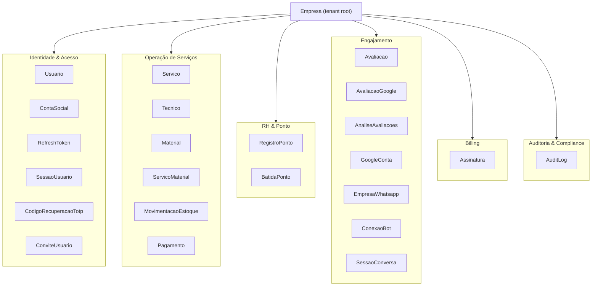

# F2 — Modelagem do Domínio (DDD)

> Modelo mental de **negócio** antes de tabela. Confronta os 25 modelos reais com os conceitos de
> DDD (entidades, value objects, eventos, agregados, bounded contexts) para achar acoplamentos e
> designar o **guardião** de cada invariant. Referência: Evans/Vernon (DDD), Event Storming (Brandolini).

## Linguagem ubíqua (glossário)

Alinhar código ↔ banco ↔ fala do dono. **Ruído a resolver:** o produto é "AdmAi" mas há resíduo
"ChaveiroBot" em textos → padronizar. Termos canônicos:

| Termo | Significado no domínio | Modelo/campo |
|---|---|---|
| Empresa | Tenant. Raiz de todo dado de negócio | `Empresa` (`empresaId` em tudo) |
| Técnico | Prestador que executa serviços; pode ter conta de painel | `Tecnico` (+ `Tecnico.usuarioId`) |
| Serviço | Trabalho executado que gera receita/comissão | `Servico` |
| Comissão | `valorLiquido × %`; só em serviço `ativo` | `Servico.comissaoGerada` |
| Aprovação | Fluxo opcional por empresa: `pendente`→`ativo`/`rejeitado` | `Empresa.aprovacaoServico`, `Servico.status` |
| Batida | Um evento de ponto (entrada/almoço/saída) com prova | `BatidaPonto` |
| Banco de horas | Agregado diário de jornada | `RegistroPonto.totalMinutos/horaExtraMinutos` |
| Avaliação | Pedido de nota ao cliente pós-serviço | `Avaliacao` |

## Entidades vs Objetos de Valor

- **Entidades** (identidade + ciclo de vida): `Empresa`, `Usuario`, `Tecnico`, `Servico`, `Material`,
  `Avaliacao`, `AvaliacaoGoogle`, `Assinatura`, `RegistroPonto`.
- **Objetos de Valor** (hoje colunas soltas — DDD sugere tratá-los como conceito): **Dinheiro**
  (valor + moeda → hoje `Float` sem moeda, ver ADR-002), **Geolocalização** (`lat/lng/precisao` de
  `BatidaPonto`), **Endereço**, **Período** (mês de competência das agregações), **Comissão %**.
  *Por quê importa:* um VO Dinheiro centraliza tipo (Decimal), moeda e arredondamento — mata o smell A1.

## Eventos de domínio (já materializados como estado/ledger)

| Evento | Como o código já registra | Observação |
|---|---|---|
| ServiçoRegistrado | `Servico` criado (`status` inicial) | via painel ou bot |
| ServiçoAprovado / Rejeitado | `Servico.status` + `aprovadoPor`/`aprovadoEm` | dispara comissão + baixa de estoque |
| EstoqueMovimentado | `MovimentacaoEstoque` (append) + `saldoApos` | **ledger** — bom padrão |
| PontoBatido | `BatidaPonto` (append) + agregado em `RegistroPonto` | mesmo padrão ledger |
| AvaliaçãoSolicitada/Respondida | `Avaliacao.status` (`pendente`→`enviada`→`respondida`) | cron via BullMQ |
| AssinaturaAtualizada | `Assinatura.status` (webhook Stripe) | idempotência do webhook |
| AçãoPrivilegiada | `AuditLog` (antes/depois) | base de auditoria |

> **Insight:** o AdmAi já usa **event-sourcing parcial** onde importa (estoque, ponto): um ledger
> append-only + uma projeção (saldo/agregado do dia). F5/F6 recomendam tornar o ledger a **fonte da
> verdade** e o saldo uma projeção reconstruível — mata o smell A10 (corrida).

## Agregados e suas invariants (com guardião designado)

Regra DDD: **uma transação não cruza dois agregados**; a raiz protege as invariants.

| Agregado (raiz) | Membros | Invariant crítica | Guardião previsto |
|---|---|---|---|
| **Serviço** (`Servico`) | `ServicoMaterial`, `MovimentacaoEstoque` gerada | comissão = líquido×%; baixa de estoque só em `ativo`; estoque não fica negativo | Transação (§F5) + `CHECK`/lógica de aprovação |
| **Estoque** (`Material`) | `MovimentacaoEstoque` | `quantidadeAtual` = soma do ledger; sem lost-update | Transação + lock/optimistic (ADR-… F5) |
| **Ponto do dia** (`RegistroPonto`) | `BatidaPonto` | 1 registro por técnico/dia (`@@unique([tecnicoId, data])`); batidas em ordem | Constraint (já existe) + máquina de estados `services/ponto.js` |
| **Identidade** (`Usuario`) | `ContaSocial`, `RefreshToken`, `SessaoUsuario`, `CodigoRecuperacaoTotp` | token rotacionado; sessão revogável (`tokenValidoApos`) | App + constraints `@unique` |
| **Avaliação** (`Avaliacao`) | — | 1 por serviço (`servicoId @unique`) | Constraint (já existe) |
| **Assinatura** (`Assinatura`) | — | 1 por empresa; ids Stripe únicos | `@unique` (já existe) |

## Bounded Contexts (proposta — orienta ownership e evolução, NÃO obriga quebrar o banco)

**Acoplamento a revisar (evidência):** `Tecnico` mistura 3 responsabilidades — **RH** (`cpf`,
`salarioBase`, `modalidade`, `jornada*`), **identidade WhatsApp** (`telefone`/LID) e **vínculo de
conta** (`usuarioId`). DDD sugere avaliar extrair um VO/entidade `DadosTrabalhistas` do `Tecnico`
(coesão do contexto RH). *Decisão em ADR-007.*

## Como validar o modelo (protocolo — precisa da equipe/dono)
1. **Event Storming** de 1–2h: colar eventos→comandos→agregados dos fluxos reais (registro via bot,
   aprovação, ponto, avaliação, billing) e conferir que cada passo casa com um modelo do schema.
2. Assinar o glossário (linguagem ubíqua) — resolve o ruído "ChaveiroBot/AdmAi".
3. Confirmar os limites de contexto acima com quem opera (ownership por time no futuro).

**✅ Critério de F2:** todo modelo mapeado a 1 agregado/contexto (feito acima); toda invariant com
guardião (feito); Event Storming assinado (⚠️ pendente com o dono).
