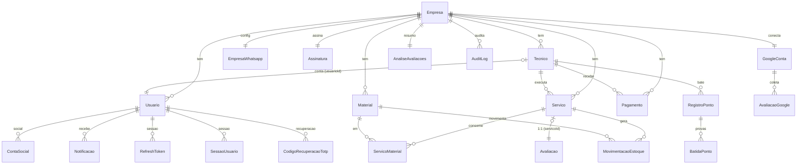

# F4 — Modelagem de Dados (conceitual → lógico → físico)

> Deriva do domínio (F2). Traz o **ER real**, o **dicionário de dados** (com sensibilidade LGPD) e os
> **achados de normalização/chaves/índices/FK**. Não escreve DDL — descreve *o que* e *por quê*.
> Referência: normalização 1NF–3NF/BCNF; integridade referencial; índices por caminho de acesso.

## ER — visão física real (extraída do `schema.prisma`)

*Fora do grafo (singletons/desacoplados):* `ConexaoBot` (singleton global id=1, número único),
`SessaoConversa` (empresaId **nullable** durante desambiguação), `ConviteUsuario`.

## Dicionário de dados (recorte — colunas com decisão/sensibilidade)

| Tabela | Coluna | Tipo real | Nota de arquitetura | LGPD |
|---|---|---|---|---|
| Empresa | `id` | Int PK | tenant root (ADR-001) | — |
| Servico | `valorCobrado/valorLiquido/comissaoGerada` | **Float** | → `Decimal` (ADR-002) | — |
| Servico | `status` | String | `ativo`/`pendente`/`rejeitado` (máquina) | — |
| Servico | `clienteNome/clienteTelefone` | String? | dado de terceiro | ⚠️ pessoal |
| Tecnico | `cpf/dataNascimento/endereco` | String?/Date? | RH | 🔴 sensível |
| Tecnico | `salarioBase/valorHora` | **Float** | → `Decimal` (ADR-002) | 🔴 sensível |
| Material | `quantidadeAtual` | Float | projeção do ledger (ADR-008) | — |
| BatidaPonto | `lat/lng/precisao` | Float? | geolocalização | 🔴 sensível |
| BatidaPonto | `selfieUrl` | String? | mídia → storage (ADR-006) | 🔴 sensível (biometria) |
| Usuario | `senhaHash` | String? | bcrypt | 🔴 credencial |
| Usuario | `totpSecret/telefoneOtpHash` | String? | cifrado em repouso | 🔴 credencial |
| Usuario | `twoFactorSecret` | String? | **legado** → deprecar (A8) | — |
| Usuario | `permissoes/notificacoes` | **Json** | schemaless legítimo (ADR-003) | — |
| GoogleConta | `accessTokenEnc/refreshTokenEnc` | String? | cifrado em repouso | 🔴 segredo |
| EmpresaWhatsapp | `accessTokenEnc` | String? | cifrado (Meta System User) | 🔴 segredo |
| ConexaoBot | `qrCode` | String (base64) | **blob no banco** → efêmero (ADR-006) | — |
| AuditLog | `antes/depois` | Json | trilha imutável (F6) | contém pessoal |
| Assinatura | `stripeCustomerId/stripeSubId` | String? @unique | billing | — |

> Dicionário **completo** (todas as 25 tabelas × colunas) deve ser gerado do schema na F9 — o
> `schema.prisma` já tem comentários ricos que servem de fonte. Aqui está o recorte que carrega decisão.

## Achados de normalização (3NF/BCNF)

| Item | Situação | Veredito |
|---|---|---|
| `Servico.valorLiquido`, `comissaoGerada` | **derivados persistidos** (`cobrado − material`, `líquido × %`) | Desnormalização **justificada** = snapshot histórico (o % de comissão do técnico muda no tempo; congelar no serviço preserva o histórico contábil). **Manter**, mas documentar como snapshot e garantir coerência na escrita. |
| `MovimentacaoEstoque.saldoApos` | derivado (saldo após a movimentação) | Justificado (auditoria do ledger). Manter. |
| `Material.quantidadeAtual` | derivado (soma do ledger) | Projeção — reconstruível (ADR-008). Aceitável com transação. |
| `Usuario.admin` (bool) vs `papel` | redundância de compat (`admin == papel=='dono'`) | Dívida conhecida (`decisions.md`). Plano de deprecação (F8). |
| `Usuario.twoFactorSecret` vs `totpSecret` | coluna legada | Deprecar (A8, Expand/Contract). |
| Demais tabelas | atômicas, sem grupos repetidos, dependências na chave | **Em 3NF.** |

**Critério:** cada desnormalização acima tem **justificativa escrita** (snapshot histórico ou projeção),
nenhuma é acidental → atende o critério de qualidade de F4.

## Chaves e restrições (constraints)

- **PK:** `Int autoincrement` (ADR-001).
- **Unicidade por-tenant (lição B8 aplicada):** `Tecnico @@unique([empresaId, telefone])`,
  `Material @@unique([empresaId, nome])`, `ServicoMaterial @@unique([servicoId, materialId])`,
  `RegistroPonto @@unique([tecnicoId, data])`, `Avaliacao.servicoId @unique`. **Critério atendido:**
  nenhuma unicidade global onde o conceito é por-empresa.
- **Unicidade global legítima:** `Usuario.username/email`, `ContaSocial([provedor, provedorSub])`,
  `RefreshToken.tokenHash`, ids Stripe — corretas (identidade cross-tenant/externa).
- **A adicionar (representar invariant no banco):** `CHECK` de domínio para `Servico.status`,
  `MovimentacaoEstoque.tipo`, `BatidaPonto.tipo` (hoje String livre) → evita estado inválido. `CHECK`
  `quantidade >= 0`. Prisma expressa via `@db`/migration manual.

## Integridade referencial (revisão de `onDelete`)

| Relação | Política atual | Revisão de negócio |
|---|---|---|
| `Servico → Empresa/Tecnico` | default (Restrict) | OK — não apagar técnico com histórico |
| `MovimentacaoEstoque → Material` | Cascade | OK (movimentação sem material não faz sentido) |
| `MovimentacaoEstoque → Servico` | SetNull | OK (preserva o ledger se o serviço sumir) |
| `BatidaPonto → RegistroPonto` | Cascade | OK |
| `RefreshToken/SessaoUsuario/… → Usuario` | Cascade | OK (limpeza de sessão) |
| `Tecnico → Usuario (usuarioId)` | SetNull | OK |
| **`* → Empresa`** | default (Restrict) | ⚠️ **decidir:** exclusão de empresa (offboarding/LGPD) precisa de rotina explícita (soft-delete + expurgo), não cascade cego — ver F6/F8 |

## Índices (refino por evidência)

- **Boa cobertura tenant:** compostos `[empresaId, …]` em `Servico`, `Avaliacao`, `RegistroPonto`, `AuditLog`.
- **Remover redundante (A6):** `Servico @@index([criadoEm])` é coberto por `[empresaId, criadoEm]`
  (o próprio schema marca como redundante) — dropar numa migration de limpeza.
- **Validar necessidade (F5):** `Servico @@index([local])`, `[endereco]`, `[clienteTelefone]` — confirmar
  que há query real que os use (senão são custo de escrita sem leitura). Decisão só após `EXPLAIN` (F5).

**✅ Critério de F4:** 3NF salvo exceções documentadas ✓ · zero UNIQUE global indevido ✓ · plano de
Decimal ✓ (ADR-002) · drift zero ✓. **⚠️ Pendente:** validar índices candidatos com EXPLAIN (F5).
